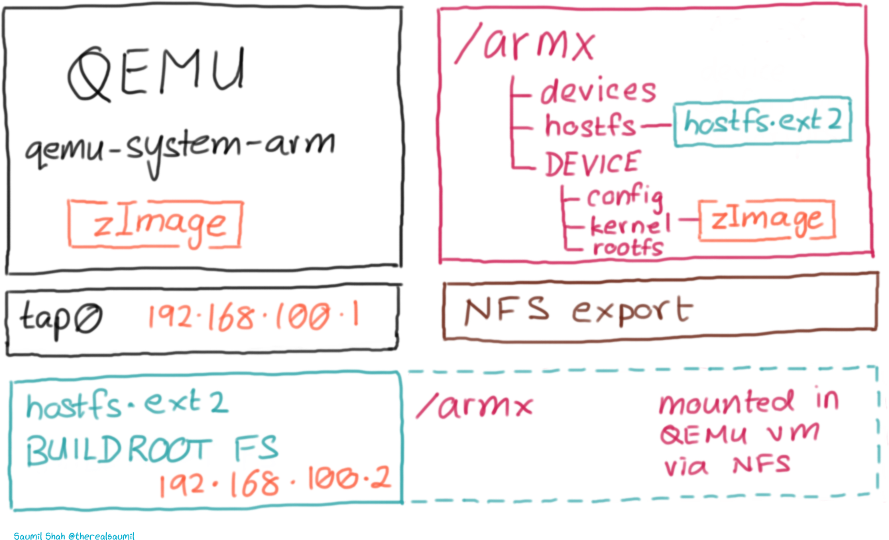
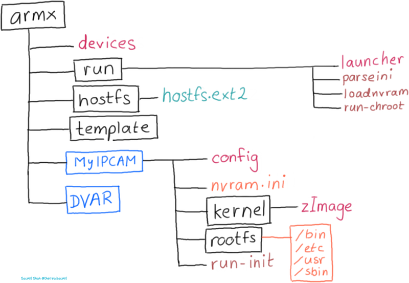
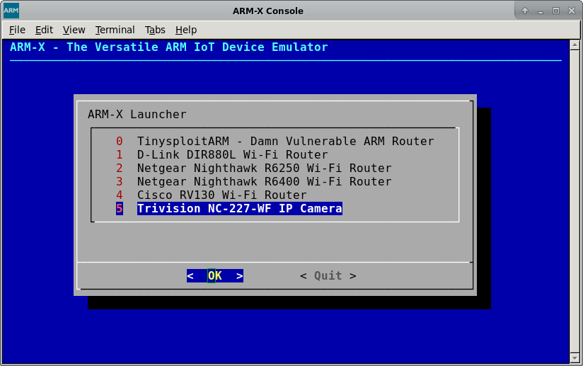
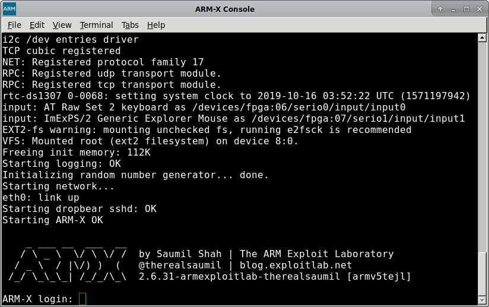
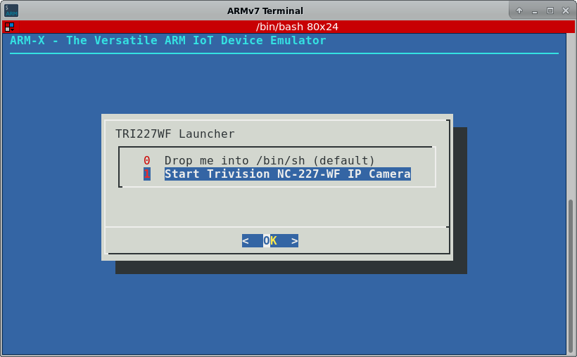
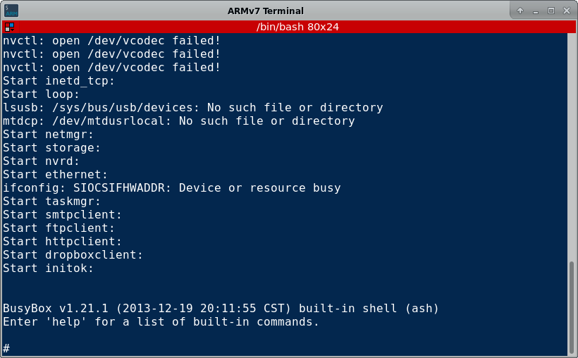
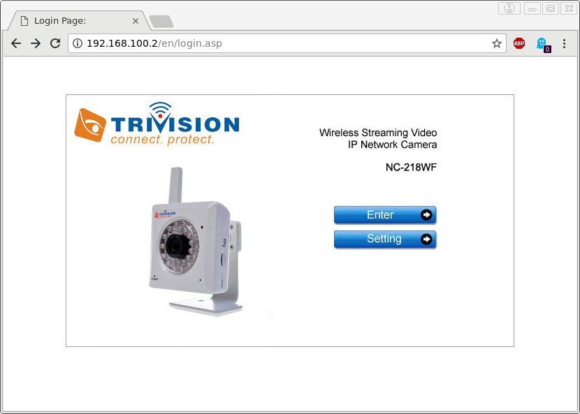
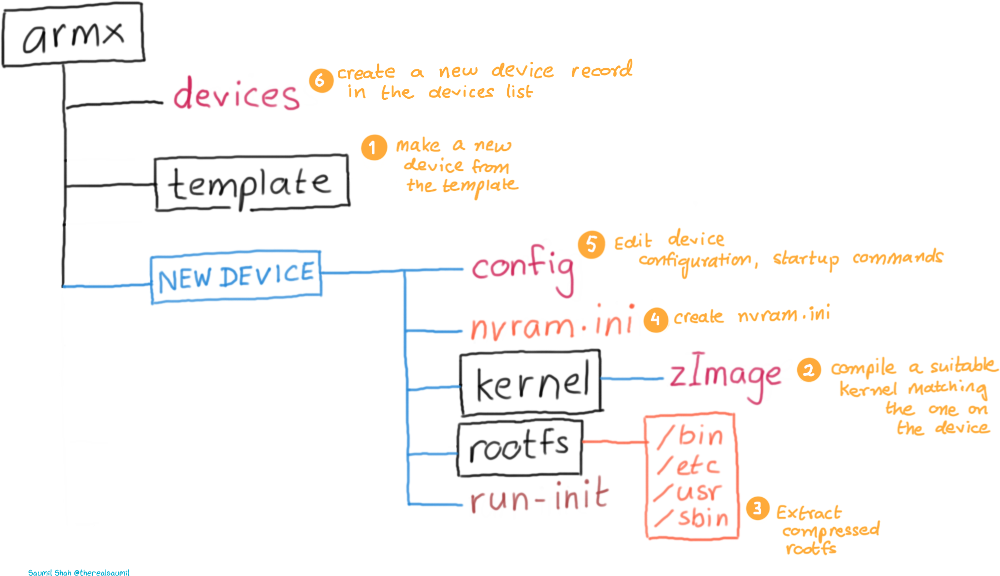

# ARM-X Firmware Emulation Framework

by Saumil Shah [@therealsaumil][saumil]

[saumil]: https://twitter.com/therealsaumil

November 2019


The ARM-X Firmware Emulation Framework is a collection of scripts, kernels and filesystems to be used with [QEMU][qemu] to emulate ARM/Linux IoT devices.  ARM-X is aimed to facilitate IoT research by virtualising as much of the physical device as possible. It is the closest we can get to an actual IoT VM.

[qemu]: https://www.qemu.org/

Devices successfully emulated with ARM-X so far:

* D-Link DIR-880L Wi-Fi Router
* Netgear Nighthawk R6250 Wi-Fi Router
* Netgear Nighthawk R6400 Wi-Fi Router
* Trivision NC227WF Wireless IP Camera
* Cisco RV130 Wi-Fi Router

Precursors of ARM-X have been used in Saumil Shah's popular [ARM IoT Exploit Laboratory][armexploitlab] training classes where students have found four 0-day vulnerabilities in various ARM/Linux IoT devices.

[armexploitlab]: https://ringzer0.training/arm-iot-exploitlab.html

## ARM-X Architecture and Operations

ARM-X is a collection of scripts, kernels and filesystems residing in the `/armx` directory. It uses `qemu-system-arm` to boot up a virtual ARM/Linux environment. The `/armx` directory is exported over NFS to also make the contents available within the QEMU guest.

The host system running `qemu-system-arm` is assigned the IP address `192.168.100.1` and the QEMU guest is assigned `192.168.100.2` via `tap0` interface.



The `/armx` directory is organised as follows:



* `devices`: This file contains device definitions, one per line.
* `run/`: This folder contains scripts necessary to parse the device configuration, preload nvram contents and eventually invoke the userland processes of the device being emulated.
* `run/launcher`: The main script. `launcher` parses the `devices` file and displays a menu of registered devices. Selecting one of the devices will in turn invoke `qemu-system-arm` with the pre-defined QEMU options, corresponding Linux kernel and extracted root file system registered with the device.
* `template/`: Sample configuration and layout for a new device. Make a copy of the template when beginning to emulate a new IoT device.

Each emulated device contains the following files/directories:

* `config`: Contains the device's name and description, ASLR settings, location of its root file system and commands to issue after the kernel has booted up and transferred control to the userland.
* `nvram.ini`: Contents of the device's non volatile memory, used for storing configuration settings. Contents of `nvram.ini` are preloaded into the emulated nvram before invoking the userland init scripts.
* `kernel/`: Contains a Linux kernel compiled (mostly via Buildroot) to closely match the properties of the emulated device such as kernel version, CPU support, VM_SPLIT, supported peripherals, etc.
* `rootfs/`: Populated with the uncompressed file system extracted from the device's firmware.
* `run-init`: Script invoked by the launcher.

The diagram below describes each stage of ARM-X:


1. Invoke `/armx/run/launcher`. This will display a menu as shown below. In this example, we select the Trivision TRI227WF Wireless IP Camera.



2. Selecting one of the devices will launch it under QEMU. The kernel which is included in the `kernel/` directory of the Trivision IP Camera's device configuration, is booted in `qemu-system-arm` and uses a pre-built Buildroot filesystem, which is referred to as `hostfs.ext2`. Host and guest IP addresses are assigned to `192.168.100.1` and `192.168.100.2` respectively.



3. `hostfs.ext2` contains several scripts and tools useful for running and dynamic analysis of the emulated device. The init scripts in `hostfs.ext2` mount the `/armx` directory over NFS. Thus, the contents of `/armx` are shared by both the host and the QEMU guest.

4. To kick off the rest of the device startup, connect to the QEMU guest using SSH `ssh root@192.168.100.2`. This brings up a menu as shown below:



5. Selecting the option to launch the userland init scripts of the device results in `run-init` being invoked from the corresponding device configuration directory within `/armx`. First, the contents of `nvram.ini` are loaded into the kernel's emulated nvram driver. Next, a `chroot` jail is created using the `rootfs` of the device. Lastly, the registered initialisation commands are invoked in the newly `chroot`ed `rootfs`, bringing up the device's services and init scripts.



6. Once the device has fully "booted up" in ARM-X, it is available for testing and analysis. The image below shows the administration interface of the IP Camera loaded in a browser:



### Creating your own emulated IoT Device

Before you begin to emulate an IoT device, you will need the following:

* Detailed analysis of the IoT device
* CPU (ARMv5/ARMv6/ARMv7)
* Linux Kernel version
* Extracted mtdblocks (rootfs)
* Contents of nvram
* Generate a compatible kernel using Buildroot or Linux Kernel sources
* A week for troubleshooting!

The following diagram outlines the overall process of IoT device emulation.



Steps involved:

1. Copy the `template` directory to make a new device configuration.
2. Compile a matching kernel from source, and place it in the `kernel/` directory.
3. Copy the extracted `rootfs` from the device's firmware into the `rootfs/` directory. Typically these would be SquashFS or CramFS filesystems, uncompressed using `binwalk` or `unsquashfs` or `cramfsck`.
4. Place the contents of extracted nvram in `nvram.ini`
5. Edit the `config` file with the newly populated device firmware contents.
6. Create a new device record in the `devices` file. Pay close attention to QEMU command line options.

The following sample kernels are provided with the template.

* `zImage-2.6.39.4-vexpress` ARMv7 CPU on a `vexpress-a9` board.
* `zImage-2.6.31.14-realview-rv130-nothumb` ARMv6 CPU on a `realview-eb` board.
* `zImage-2.6.31-versatile-nothumb` ARMv5 CPU on a `versatilepb` board.

However, it is encouraged to build a compatible kernel from source.

### ARM-X Presentations

Presentation at [Countermeasure 2019][cmeasurecon] on 7 November 2019.

[cmeasurecon]: https://www.countermeasure.ca/speaker/saumil-udayan-shah/

<iframe src="//www.slideshare.net/slideshow/embed_code/key/6P5quK19YMwYQ5" width="595" height="485" frameborder="0" marginwidth="0" marginheight="0" scrolling="no" style="border:1px solid #CCC; border-width:1px; margin-bottom:5px; max-width: 100%;" allowfullscreen> </iframe> <div style="margin-bottom:5px"> <strong> <a href="//www.slideshare.net/saumilshah/inside-armx-countermeasure-2019" title="INSIDE ARM-X - Countermeasure 2019" target="_blank">INSIDE ARM-X - Countermeasure 2019</a> </strong> from <strong><a href="https://www.slideshare.net/saumilshah" target="_blank">Saumil Shah</a></strong> </div>

Release presentation at [HITB+Cyberweek][HITB] on 16 October 2019.

[HITB]: https://cyberweek.ae/speaker/saumil-shah/

<iframe src="https://www.slideshare.net/slideshow/embed_code/key/9FqUwLVZaoLaxO" width="595" height="485" frameborder="0" marginwidth="0" marginheight="0" scrolling="no" style="border:1px solid #CCC; border-width:1px; margin-bottom:5px; max-width: 100%;" allowfullscreen> </iframe> <div style="margin-bottom:5px"> <strong> <a href="//www.slideshare.net/saumilshah/introducing-armx" title="Introducing ARM-X" target="_blank">Introducing ARM-X</a> </strong> from <strong><a href="https://www.slideshare.net/saumilshah" target="_blank">Saumil Shah</a></strong> </div>

### The ARM IoT Firmware Laboratory - NEW TRAINING

> An all new class where the ARM IoT EXPLOIT LABORATORY leaves off. The ARM IoT Firmware Laboratory dives into analysis, extraction and emulation of IoT device firmware, using a variety of techniques. Students shall be given ample hands on practice in emulating a variety of IoT devices. Lab exercises feature firmware extraction directly from the hardware, building a custom kernel and buildroot environment, extracting contents of nvram and emulating the device under ARM-X. The class also goes on to fuzzing and exploit development exercises for the emulated devices.


#### Upcoming classes: 

1. **44CONnect Training December 2020, London:**
https://44con.com/44con-training/arm-iot-firmware-laboratory-2020-preview/

2. **OffensiveCon 2020, Berlin:**
https://www.offensivecon.org/trainings/2020/the-arm-iot-firmware-laboratory-2020.html


### Downloads
#### Pre-built VM with ARM-X installed

VMware VM: https://app.box.com/s/3iyi5f6vpakngh8ti3ir2zzukgdu0j2q

The ARM-X VM is compressed using 7-Zip. The archive is split into multiple files of 200MB each, because several cloud hosting providers impose a maximum limit. To extract the VM, use the 7z command line utility:

`7z e armx-november2019.7z.001`

SHA 256 Checksums:

```
d49b537211607feb36cfc1df03a3b86c4f2dccb905fd96ca79f768caa7500e05  armx-november2019.7z.001
34e1a939707ea08bf1487cc354c8c7ea79911f72894528f5381c5bf12e9fd485  armx-november2019.7z.002

2fa814609c86b2ecf331508f38d4b24834d814cf2f203f499a6ffd7681f7ef26  armx-alpine.vmx
ed28f8bbc792825b8d432372387c9ebc773a023732cfe9c75cfd5545899c401a  armx-s001.vmdk
421f097547f71ff0d3f1c7d189d457f1b25a27e7b0e69af69f3bc0abf2a59a92  armx.vmdk
```

VirtualBox VM: (coming soon, but don't hold your breath)

#### ARM-X Code

Github: https://github.com/therealsaumil/armx/

### TODO

* Clean up the documentation

### END

ARM-X is licensed under the Mozilla Public License v2.0 (MPLv2).

- v0.9.0  22-October-2019, Preview Release
- v0.9.1  19-November-2019


