# ARMX Firmware Emulation Framework

by Saumil Shah [@therealsaumil][saumil]

[saumil]: https://twitter.com/therealsaumil

June 2021

## NEW RELEASE: ARMX ON DOCKER


A brand new Docker container running ARMX. Going ahead, all official ARMX releases shall be released as Docker images. Lightweight, Compact, Easy.

> ### Shut up and give me the g00diez
>
> Github: https://github.com/therealsaumil/armx
>
> A brand new ARMX Docker image is ready for use! The old "Preview VM" is now discontinued in favour of the Docker image.

### QUICK INSTALL STEPS

#### Step 1 - Clone this repository

```
git clone --depth 1 --single-branch  https://github.com/therealsaumil/armx.git
```

#### Step 2 - Build the docker volume and image

```
cd armx
./build-armx-volume
./build-armx-docker
```

#### Step 3 - Run ARMX!

Open a terminal, and start the `armx-docker` container:

```
./run-armx-docker
```

You will be greeted with a purple shell prompt `[r0@ARMX-DOCKER 🐳:~$]`. After a while, it is common to have many terminals attached to the container. Coloured shell prompts makes it easy to remember where you are.

Next, start the ARMX `launcher`:

```
[r0@ARMX-DOCKER 🐳:~$] launcher
```

and select any emulated device that you wish to run.

#### Step 4 - Launch the emulated device's userland processes.

Next, open a new terminal and attach to the running `armx-docker` container:

```
./armx-docker-shell
```

All attached container shells have a blue shell prompt. Invoke the `userspace` command to bring up the userland processes of the emulated target:

```
[r0@armx-docker shell 🐚:~$] userspace
```

Read the documentation for more details.

## INTRODUCING


The ARMX Firmware Emulation Framework is a collection of scripts, kernels and filesystems to be used with [QEMU][qemu] to emulate ARM/Linux IoT devices.  ARMX is aimed to facilitate IoT research by virtualising as much of the physical device as possible. It is the closest we can get to an actual IoT VM.

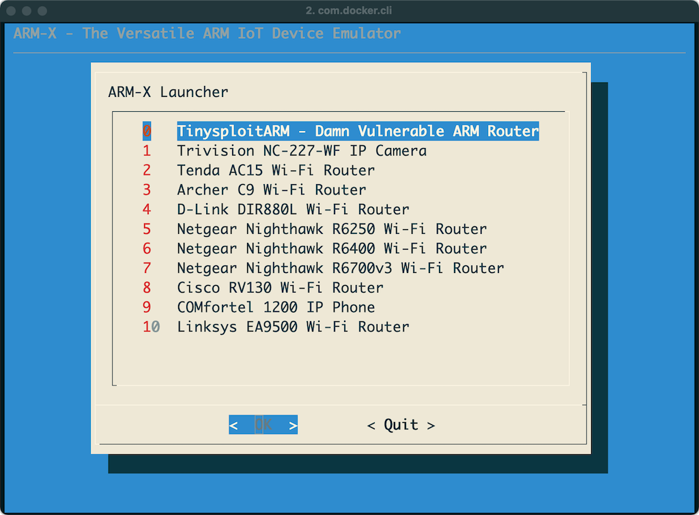

[qemu]: https://www.qemu.org/

Devices successfully emulated with ARMX so far:

* [TinysploitARM - Damn Vulnerable ARM Router][DVAR]
* Trivision NC227WF Wireless IP Camera
* [Tenda AC15 Wi-Fi Router][emulatingtenda] [(Github Docs)][md-emulatingtenda]
* NEW! Archer C9 Wi-Fi Router
* D-Link DIR-880L Wi-Fi Router
* Netgear Nighthawk R6250 Wi-Fi Router
* Netgear Nighthawk R6400 Wi-Fi Router
* NEW! Netgear Nighthawk R6700v3 Wi-Fi Router
* Cisco RV130 Wi-Fi Router
* COMfortel 1200 VoIP Phone
* Linksys EA9500 Wi-Fi Router

Precursors of ARMX have been used in Saumil Shah's popular [ARM IoT Exploit Laboratory][armfirmwarelab] training classes where students have found ~~four~~ several 0-day vulnerabilities in various ARM/Linux IoT devices.

[DVAR]: https://blog.exploitlab.net/2018/01/dvar-damn-vulnerable-arm-router.html
[armfirmwarelab]: https://ringzer0.training/arm-iot-exploitlab.html

## ARMX Architecture

ARMX is a collection of scripts, kernels and filesystems residing in the `/armx` directory. It uses `qemu-system-arm` to boot up a virtual ARM/Linux environment. The `/armx` directory is exported over NFS to also make the contents available within the QEMU guest.

The host system running `qemu-system-arm` is assigned the IP address `192.168.100.1` and the QEMU guest is assigned `192.168.100.2` via `tap0` interface.

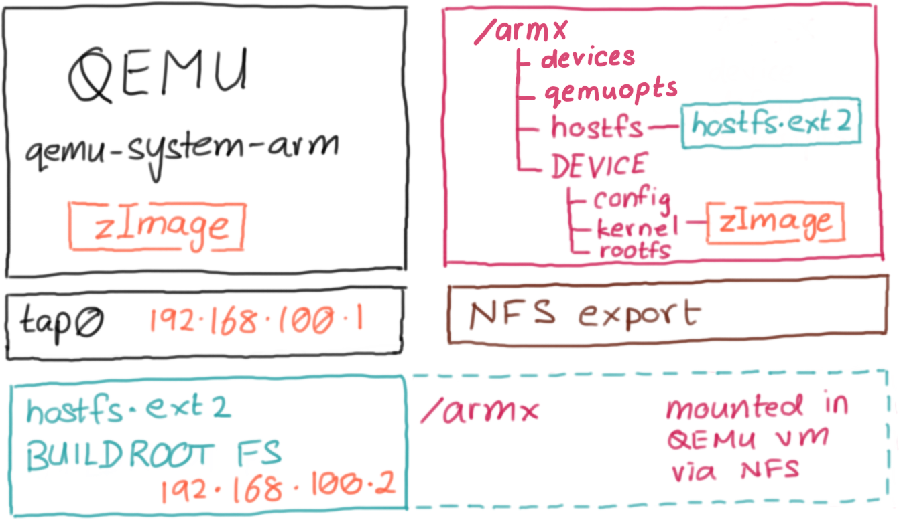

ARMX is packaged as a Docker image. The diagram below shows how the docker container is organised:

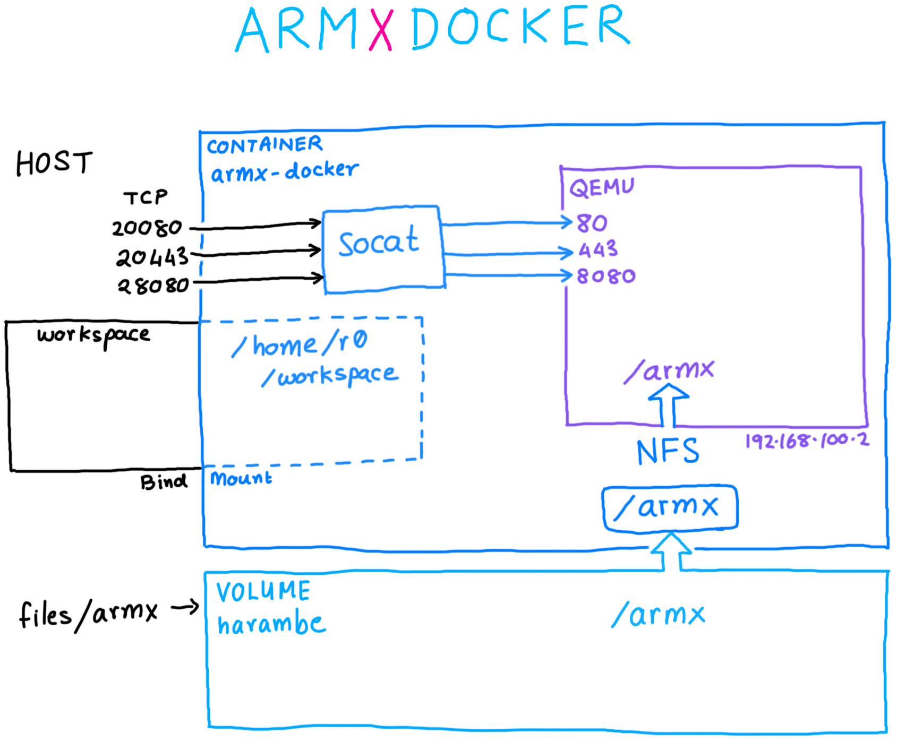

The docker image consists of:

* Volume `harambe` containing the `/armx` directory tree. (🦍 Harambe be praised!)
* Container `armx-docker`.
* Directory `workspace` on the host bind mounted as `/home/r0/workspace` in the container, to share files.
* NFS server running inside the container serving the `/armx` directory tree to emulated images running under QEMU
* Port forwarding from the host to QEMU running inside the container is done using `socat`.

## The /armx directory

The `/armx` directory is organised as follows:

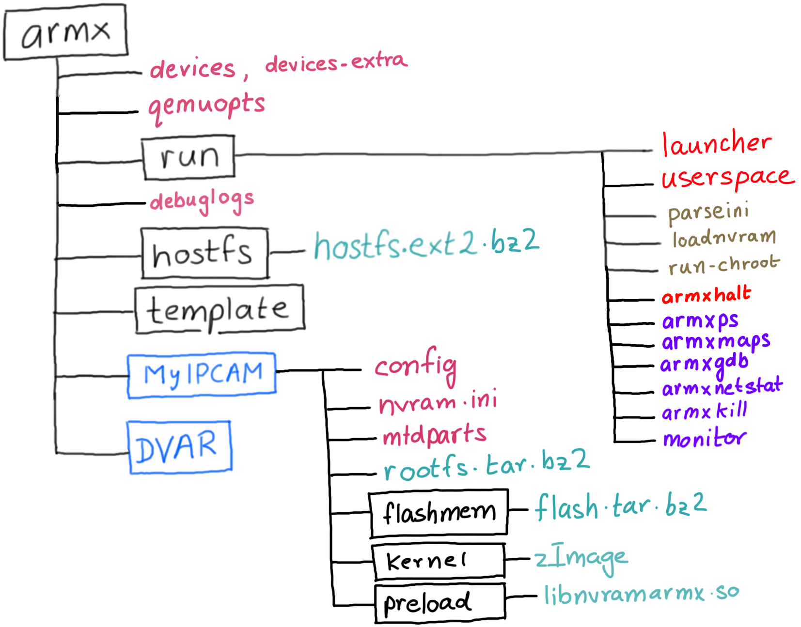

* `devices`: This file contains device definitions, one per line.
* `devices-extra`: Contains additional emulated devices not included in the general release. It is recommended that you add your own emulated devices to `devices-extra`.
* `qemuopts`: Abstracted QEMU options definitions for various types of QEMU Machines.
* `run/`: This folder contains scripts necessary to parse the device configuration, preload nvram contents and eventually invoke the userland processes of the device being emulated.
* `run/launcher`: The main script. `launcher` parses the `devices` file and displays a menu of registered devices. Selecting one of the devices will in turn invoke `qemu-system-arm` with the pre-defined QEMU options, corresponding Linux kernel and extracted root file system registered with the device.
* `run/userspace`: Start the userspace processes of an emulated device, once the kernel is booted up from the `launcher`.
* `debuglogs`: If present, it indicates the location where ARMX debugging logs will be written to. Extremely helpful in troubleshooting while creating a new emulated device.
* `template/`: Sample configuration and layout for a new device. Make a copy of the template when beginning to emulate a new IoT device.

The `run/` directory also contains a few commands that can be used from the host to interact with processes running within an ARMX emulated device.

* `armxhalt`: Cleanly shut down the emulated device, and unmount all NFS mounts. Without a clean shutdown, there's always the risk of stale NFS handles.
* `armxps`: Remotely enumerate processes running within ARMX.
* `armxmaps`: Remotely dump the process memory layout of a process running within ARMX.
* `armxnetstat`: Enumerate network sockets within ARMX.
* `armxkill`: Remotely terminate a process running within ARMX.
* `armxgdb`: Attach `gdb` to a process running within ARMX.
* `monitor`: Attach to the QEMU monitor.

`armxps`, `armxmaps` and `armxgdb` are explained in detail in the [Debugging With ARMX][debuggingwitharmx] tutorial.

## Contents of an emulated device

Each emulated device contains the following files/directories:

* `config`: Contains the device's name and description, ASLR settings, location of its root file system and commands to issue after the kernel has booted up and transferred control to the userland.
* `nvram.ini`: Contents of the device's non volatile memory, used for storing configuration settings. Contents of `nvram.ini` are preloaded into the emulated nvram before invoking the userland init scripts.
* `kernel/`: Contains a Linux kernel compiled (mostly via Buildroot) to closely match the properties of the emulated device such as kernel version, CPU support, VM_SPLIT, supported peripherals, etc.
* `rootfs.tar.bz2`: A compressed archive containing the Root File System extracted from the target device. The name `rootfs.tar.bz2` is configurable from within the `config` file. ARMX will automatically unpack the Root File System the first time it is invoked.
* `flashmem/flash.tar.bz2`: A compressed archive containing two 64MB memory dump files `flash0.bin` and `flash1.bin`. These will be visible as a unified 128MB MTD Flash device.

## Running an emulated device in ARMX

The diagram below describes each stage of ARMX:

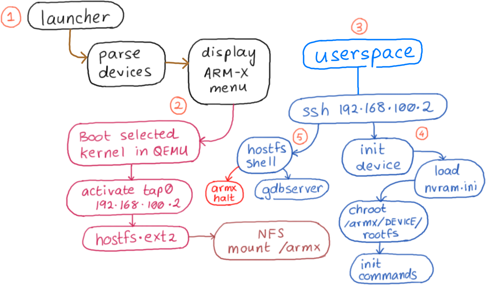

There are five steps in running an emulated device:

1. Launcher - choose from a list of available emulated devices
2. Select a device and boot its kernel and its hostfs
3. Userspace - choose from a list of available userspace actions
4. Start the devices' userspace processes
5. Optionally drop into the hostfs shell

### Step 1: The Launcher

Invoke `launcher`.

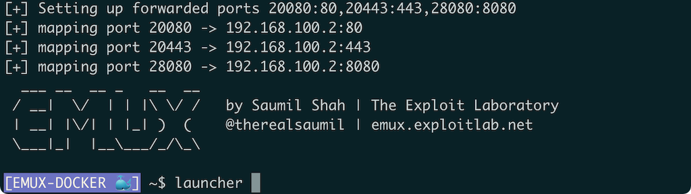

This will display a menu as shown below. In this example, we select the Trivision TRI227WF Wireless IP Camera.

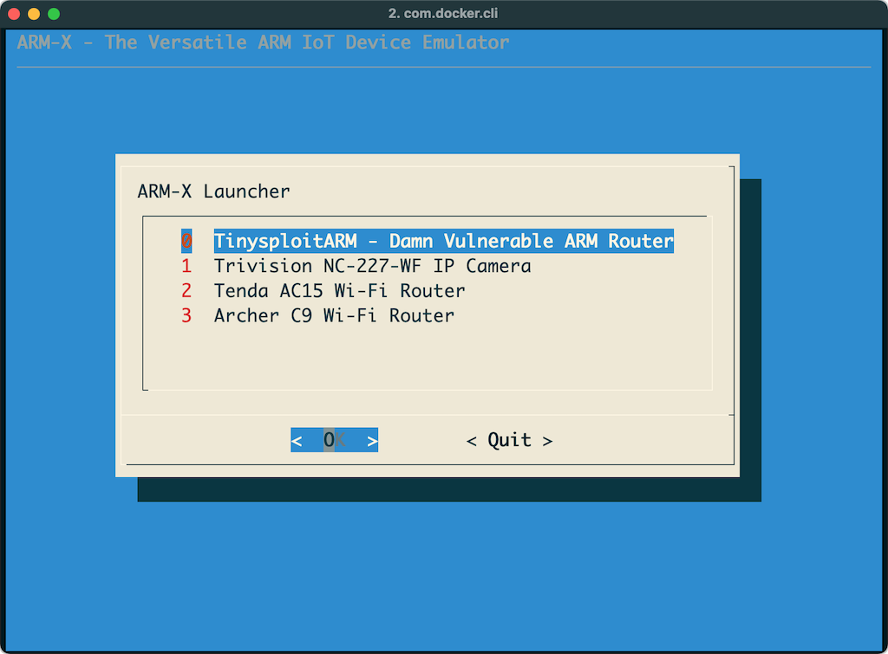

### Step 2: Start a device

Selecting one of the devices will launch it under QEMU. The kernel which is included in the `kernel/` directory of the Trivision IP Camera's device configuration, is booted in `qemu-system-arm` and uses a pre-built Buildroot filesystem, which is referred to as `hostfs.ext2`. Host and guest IP addresses are assigned to `192.168.100.1` and `192.168.100.2` respectively.

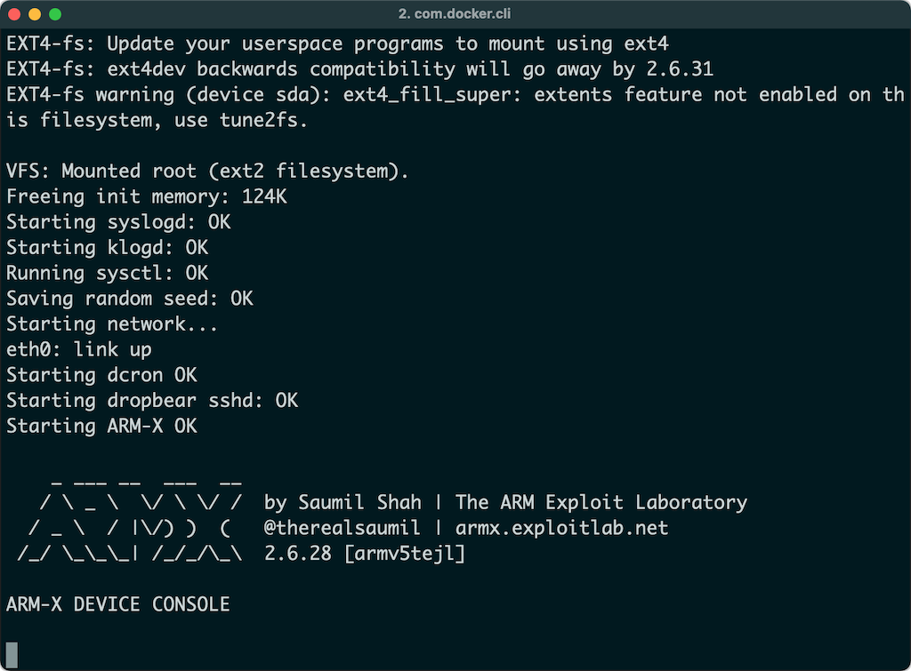

`hostfs.ext2` contains several scripts and tools useful for running and dynamic analysis of the emulated device. The init scripts in `hostfs.ext2` mount the `/armx` directory over NFS. Thus, the contents of `/armx` are shared by both the host and the QEMU guest.

### Step 3: Userspace

You will need to attach to the running `armx-docker` container and invoke the `userspace` command at the shell prompt.

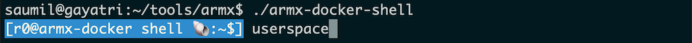

Internally the `userspace` command simply connects to the QEMU guest using SSH `ssh root@192.168.100.2`. This brings up a menu as shown below:

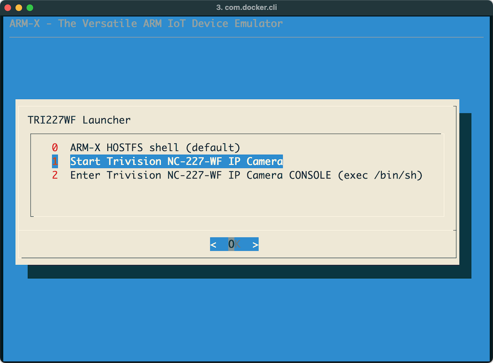

### Step 4: Start the userspace processes

Selecting the option to launch the userspace processes of the device results in `run-init` being invoked from the corresponding device configuration directory within `/armx`. First, the contents of `nvram.ini` are loaded into the kernel's emulated nvram driver. Next, a `chroot` jail is created using the `rootfs` of the device. Lastly, the registered initialisation commands are invoked in the newly `chroot`ed `rootfs`, bringing up the device's services and init scripts.

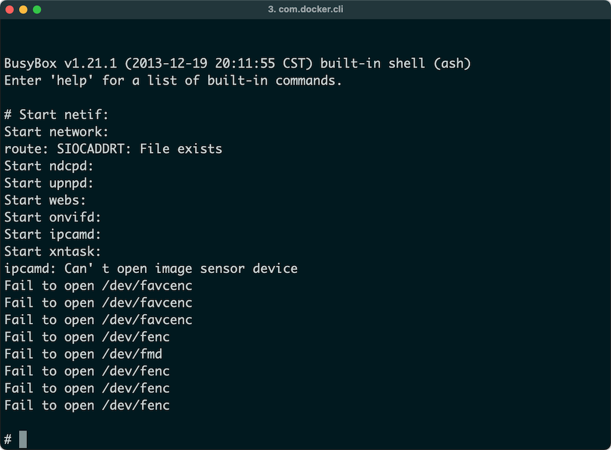

### Step 5: Device booted up and ready

Once the device has fully "booted up" in ARMX, it is available for testing and analysis. The image below shows the administration interface of the IP Camera loaded in a browser. Note, to access the internal ports on `192.168.100.2` we will rely on port forwarding performed by `socat`. By default, the following ports are forwarded:

```
localhost:20080 -> 192.168.100.2:80
localhost:20443 -> 192.168.100.2:443
localhost:28080 -> 192.168.100.2:8080
```

To access the web administration interface for the booted up device, open a browser and navigate to `localhost:28000`. This in turn will forward your request to `192.168.100.2:80` inside the `armx-docker` container.

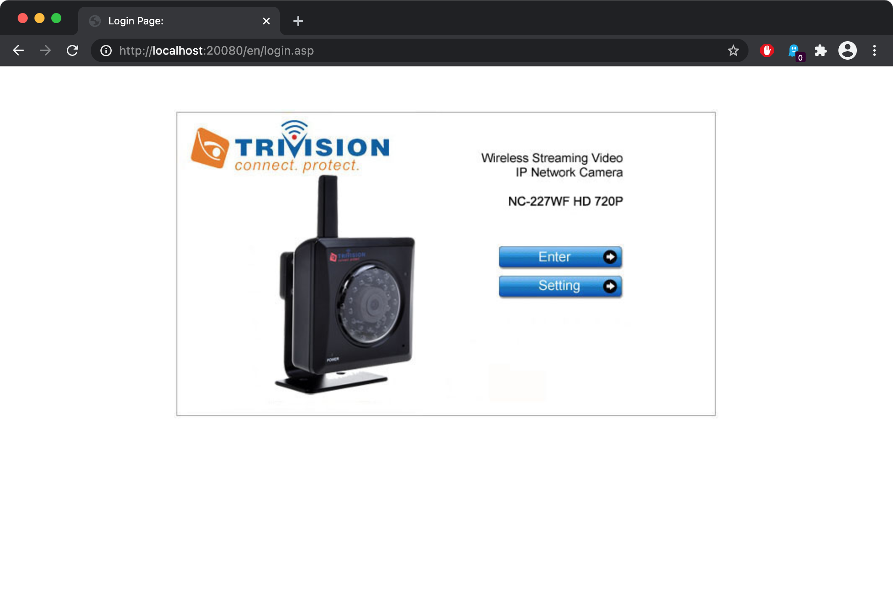

#### Overriding the forwarded ports

ARMX port forwarding is controlled by the `PORTFWD` environment variable. It is a comma separated list containing `FORWARDED_PORT:INTERNAL_PORT` pairs. To override the default port forwarding, simply set the contents of `PORTFWD` before invoking `run-armx-docker`:

```
export PORTFWD="28000:8000,25800:5800"
./run-armx-docker
```

## Creating your own emulated IoT Device

Before you begin to emulate an IoT device, you will need the following:

* Detailed analysis of the IoT device
* CPU (ARMv5/ARMv6/ARMv7)
* Linux Kernel version
* Contents of the extracted flash memory (optional)
* Extracted Root File System from the flash memory
* Contents of nvram (optional)
* Generate a compatible kernel using Buildroot or Linux Kernel sources
* A week for troubleshooting!

The following diagram outlines the overall process of IoT device emulation.


Steps involved:

1. Copy the `template` directory to make a new device configuration.
2. Compile a matching kernel from source, and place it in the `kernel/` directory. You may also symlink an existing kernel if you wish to.
3. Copy the extracted `rootfs` from the device's firmware into the `rootfs/` directory. Typically these would be SquashFS or CramFS filesystems, uncompressed using `binwalk` or `unsquashfs` or `cramfsck`. Optionally you may also create a compressed `tar.bz2` archive of the root file system.
4. Place the contents of extracted nvram in `nvram.ini`
5. If you wish to emulate MTD flash, dump the contents of your device's flash memory and create two 64MB files named `flash0.bin` and `flash1.bin` and place them in the `flashmem/` directory. Optionally you may also compress them in a `tar.bz2` archive. You will then need to define the MTD partition layout to be passed to the kernel in the `mtdparts` file.
6. Place any shared libraries that you wish to inject using `LD_PRELOAD` in the `preload/` directory. Usually these shared libraries contain hooked functions necessary for certain emulated binaries to work properly.
7. Edit the `config` file with the newly populated device firmware contents.
8. Create a new device record in the `devices-extra` file. Pay close attention to QEMU command line options.

The following sample kernels are provided with the template.

* `zImage-2.6.39.4-vexpress` ARMv7 CPU on a `vexpress-a9` board.
* `zImage-2.6.31.14-realview-rv130-nothumb` ARMv6 CPU on a `realview-eb` board.
* `zImage-2.6.31-versatile-nothumb` ARMv5 CPU on a `versatilepb` board.
* `zImage-2.6.29.6-versatile` ARMv5 CPU on a `versatilepb` board.
* `zImage-2.6.28-versatile-nothumb` ARMv5 CPU on a `versatilepb` board.

However, it is encouraged to build a compatible kernel from source.

### The ARMX Activity Log File

The June 2021 release of ARMX comes with a feature to enable activity logs. This comes in very handy in troubleshooting errors when adding a new device to ARMX. To enable logging, edit the `/armx/debuglogs` file:

```
# Uncomment logpath= to enable ARMX and QEMU console output logging.
# Only one logpath= should be uncommented.
#
#logpath=/home/r0/workspace/logs/
#logpath=/armx/logs/
```

It is recommended to use `/home/r0/workspace/logs` since the `workspace` directory is shared between the container and the host.

## ARMX In The Public

#### Presentation at [Countermeasure 2019][cmeasurecon] on 7 November 2019. 👇

[cmeasurecon]: https://www.countermeasure.ca/speaker/saumil-udayan-shah/

<iframe src="https://www.slideshare.net/slideshow/embed_code/key/6P5quK19YMwYQ5" width="595" height="485" frameborder="0" marginwidth="0" marginheight="0" scrolling="no" style="border:1px solid #CCC; border-width:1px; margin-bottom:5px; max-width: 100%;" allowfullscreen> </iframe> <div style="margin-bottom:5px"> <strong> <a href="//www.slideshare.net/saumilshah/inside-armx-countermeasure-2019" title="INSIDE ARMX - Countermeasure 2019" target="_blank">INSIDE ARMX - Countermeasure 2019</a> </strong> from <strong><a href="https://www.slideshare.net/saumilshah" target="_blank">Saumil Shah</a></strong> </div>

#### Release presentation at [HITB+Cyberweek][HITB] on 16 October 2019. 👇

[HITB]: https://cyberweek.ae/speaker/saumil-shah/

<iframe src="https://www.slideshare.net/slideshow/embed_code/key/9FqUwLVZaoLaxO" width="595" height="485" frameborder="0" marginwidth="0" marginheight="0" scrolling="no" style="border:1px solid #CCC; border-width:1px; margin-bottom:5px; max-width: 100%;" allowfullscreen> </iframe> <div style="margin-bottom:5px"> <strong> <a href="//www.slideshare.net/saumilshah/introducing-armx" title="Introducing ARMX" target="_blank">Introducing ARMX</a> </strong> from <strong><a href="https://www.slideshare.net/saumilshah" target="_blank">Saumil Shah</a></strong> </div>

#### Announcing ARMX Docker on 15 June 2021. 👇

<iframe src="https://www.slideshare.net/slideshow/embed_code/key/dMzOpTu1gfAriw" width="595" height="485" frameborder="0" marginwidth="0" marginheight="0" scrolling="no" style="border:1px solid #CCC; border-width:1px; margin-bottom:5px; max-width: 100%;" allowfullscreen> </iframe> <div style="margin-bottom:5px"> <strong> <a href="//www.slideshare.net/saumilshah/announcing-armx-docker-dc11332" title="Announcing ARMX Docker - DC11332" target="_blank">Announcing ARMX Docker - DC11332</a> </strong> from <strong><a href="https://www.slideshare.net/saumilshah" target="_blank">Saumil Shah</a></strong> </div>

### The ARM IoT Firmware Laboratory - NEW TRAINING

> An all new class where the ARM IoT EXPLOIT LABORATORY leaves off. The ARM IoT Firmware Laboratory dives into analysis, extraction and emulation of IoT device firmware, using a variety of techniques. Students shall be given ample hands on practice in emulating a variety of IoT devices. Lab exercises feature firmware extraction directly from the hardware, building a custom kernel and buildroot environment, extracting contents of nvram and emulating the device under ARMX. The class also goes on to fuzzing and exploit development exercises for the emulated devices.

#### Upcoming classes:

**Ringzer0 #VirtualVegas August 2021, Online Remote Training: (4 day class)**
https://ringzer0.training/arm-iot-exploitlab.html

### Downloads

> The pre-built ARMX PREVIEW VM is now discontinued. You are encouraged to use **ARMX on Docker**

#### ARMX Code

Github: https://github.com/therealsaumil/armx/

### ARMX Documentation

- Tutorial: [Debugging With ARMX][debuggingwitharmx] [(Github Doc)][md-debuggingwitharmx]
- Case Study: [Emulating the Tenda AC15 Router][emulatingtenda] [(Github Doc)][md-emulatingtenda]
- Case Study: [Extracting the Tenda AC15 Firmware][fw-extraction] [(Github Doc)][md-fw-extraction]
- **NEW!** Install guide: [Installing ARMX on Kali][install-kali] [(Github Doc)][md-install-kali]

[debuggingwitharmx]: docs/debugging-with-armx.html
[emulatingtenda]: docs/emulating-tenda-ac15.html
[fw-extraction]: docs/extracting-tenda-ac15-firmware.html
[install-kali]: docs/install-armx-kali.html

[md-debuggingwitharmx]: docs/debugging-with-armx.md
[md-emulatingtenda]: docs/emulating-tenda-ac15.md
[md-fw-extraction]: docs/extracting-tenda-ac15-firmware.md
[md-install-kali]: docs/install-armx-kali.md

### END

ARMX is licensed under the Mozilla Public License v2.0 (MPLv2).

- v0.9  22-October-2019, Preview Release
- v1.0  19-November-2019
- v1.1  12-March-2020
- v1.2  05-May-2020
- v1.2  20-May-2020 (minor update)
- v1.3  02-June-2020
- v1.4  11-September-2020
- v2.0  17-June-2021

