# Emulating the TP-Link Archer C9 Wi-Fi Router with ARM-X

by Saumil Shah [@therealsaumil][saumil]

[saumil]: https://twitter.com/therealsaumil

September 2020

## TL;DR:

The [TP-Link Archer C9 Wi-Fi Router](https://www.gadgetreview.com/tp-link-archer-c9-router-review) is
a nice piece of hardware. It's software is based on [OpenWRT](https://openwrt.org/).
Emulating the Archer C9 involved a few tricks.


Emulating the AC15 router was a challenging exercise. The firmware couldn't be
obtained via the [standard UART extraction](https://www.slideshare.net/saumilshah/hacklu-2018-arm-iot-firmware-emulation-workshop/19)
technique that I usually use for most IoT devices. The AC15 doesn't store all
its configuration data in the `nvram`, some of it is in a separate MTD
partition. Launching the AC15's start up programs caused them to crash and the
system to reboot, because certain custom library calls didn't return the values
that were expected, due to missing emulated hardware. It took quite a bit of
reverse engineering to figure out which functions we need to shim using
`LD_PRELOAD`.

Eventually, the labour bore fruit.

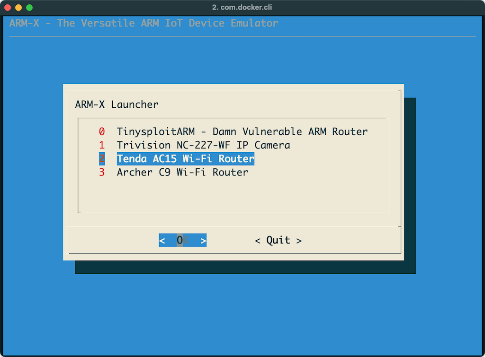
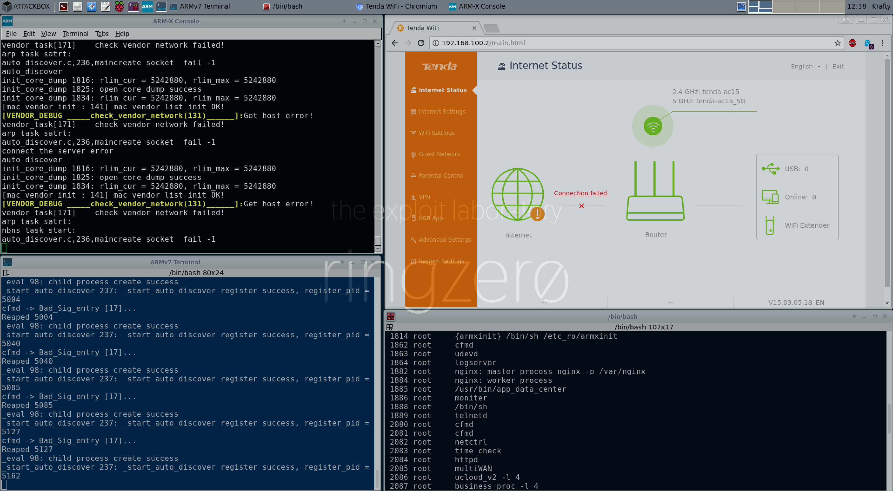

The emulation process was an great learning experience for me, which I present
here. Read on!

## I can haz?

The emulated Archer C9 is included in the
[September 2020 ARM-X Preview VM](https://armx.exploitlab.net/#downloads). You're
welcome.

## Introduction

The COVID-19 lockdown saw me working hard at [ARM-X][armx], fixing bugs and
adding new features for my upcoming [ARM IoT Firmware Laboratory][R0ARM]
training. I wanted to show off ARM-X's `nvram` handling capabilities and also to
emulate a "popular" ARM IoT device that readers can easily get hardware access
to.

The Tenda AC15 is complex enough when it comes to emulation. This case study
is written more as a tutorial for emulating your own hardware device.

The approach described here does not require you to have a physical Tenda
router on hand. All you need is a copy of the Tenda firmware from its website.

I subsequently intend to publish two more articles
- [Extracting the Tenda AC15's firmware directly from its SPI Flash chip][fw-extraction], and
- Exploiting the vast array of vulnerabilities present in the AC15.

## Contents

- [Section 1](#section-1---obtaining-the-firmware) - Obtaining the Firmware.
  - [1.1](#11-download-the-ac15-firmware) Download the AC15 Firmware
  - [1.2](#12-binwalk-the-firmware) binwalk the firmware
  - [1.3](#13-tracing-our-way-through-the-init-process) Tracing our way through the init process
- [Section 2](#section-2---emulation-attempt-1) - Emulation attempt #1
  - [2.1](#21-creating-the-tenda-device-directory) Creating the Tenda device directory
  - [2.2](#22-choosing-a-kernel) Choosing a kernel
  - [2.3](#23-copy-the-root-file-system) Copy the root file system
  - [2.4](#24-nvramini) nvram.ini
  - [2.5](#25-edit-the-config-file) Edit the config file
  - [2.6](#26-create-a-record-in-armxdevices) Create a record in /armx/devices
  - [2.7](#27-starting-the-tenda-ac15-attempt-1) Starting the Tenda AC15, attempt #1
- [Section 3](#section-3---reverse-engineering-with-ghidra) - Reverse Engineering with Ghidra
  - [3.1](#31-code-snippets-from-reversed-functions---part-1) Code snippets from reversed functions - part 1
  - [3.2](#32-code-snippets-from-reversed-functions---part-2) Code snippets from reversed functions - part 2
  - [3.3](#33-error-message-nvram-partition-is-destroy) Error message "nvram partition is destroy"
  - [3.4](#34-bcm_nvram_-functions) bcm_nvram_ functions
- [Section 4](#section-4---emulation-attempt-2---hooked-functions) - Emulation attempt #2 - hooked functions
  - [4.1](#41-tenda_hooksc) tenda_hooks.c
  - [4.2](#42-using-tenda_hooksso) Using tenda_hooks.so
  - [4.3](#43-preparing-for-a-limited-emulation) Preparing for a limited emulation
  - [4.4](#44-starting-the-tenda-ac15-attempt-2) Starting the Tenda AC15, attempt #2
  - [4.5](#45-creating-nvram_ac15ini) Creating nvram_AC15.ini
- [Section 5](#section-5---the-emulated-tenda-ac15) - The Emulated Tenda AC15
  - [5.1](#51-starting-the-tenda-ac15-attempt-3) Starting the Tenda AC15, attempt #3
  - [5.2](#52-fixing-the-factory-defaults) Fixing the "factory defaults"
  - [5.3](#53-starting-the-tenda-ac15-final-attempt) Starting the Tenda AC15, final attempt
  - [5.4](#54-process-memory-layout) Process Memory Layout
  - [5.5](#55-interacting-with-the-tendas-web-interface) Interacting with the Tenda's web interface
- [Concluding thoughts](#concluding-thoughts)

## Section 1 - Obtaining the Firmware

There are three popular techniques for obtaining the firmware. My preference is
to grab the firmware from the physical router. This way, we can also obtain a
snapshot of the configuration stored in its `nvram`.

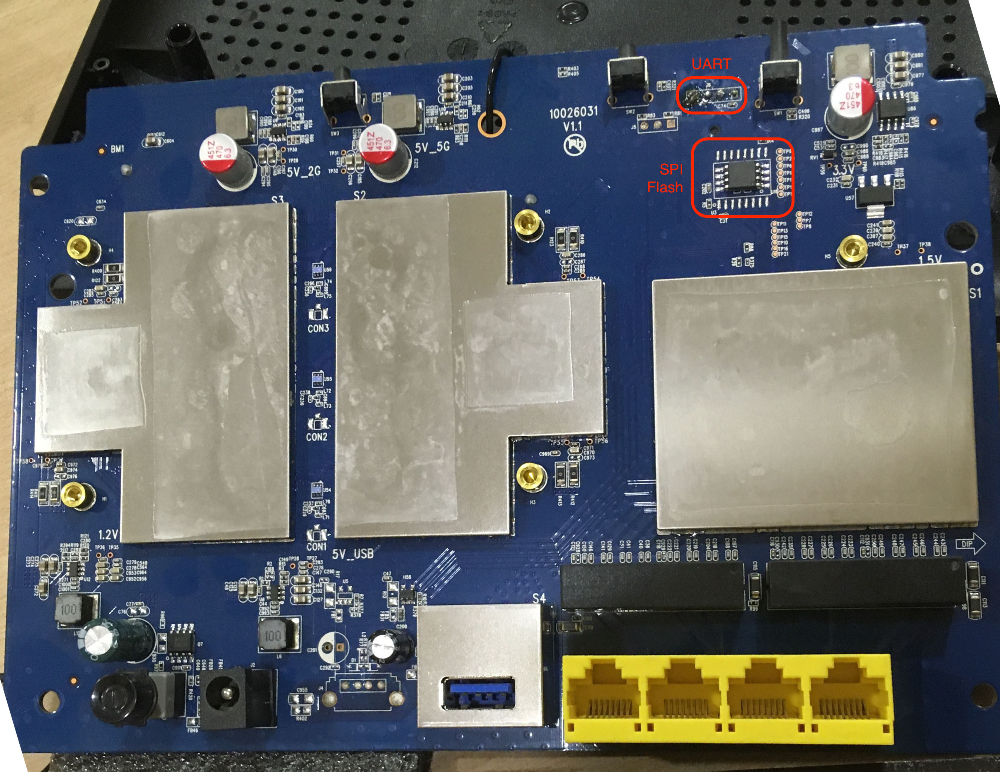

1. Discover the UART, access the `/dev/console`, hopefully find a shell and
dump the `/dev/mtdblock`s. This is my preferred technique.
2. Extract the firmware directly from the SPI Flash memory using an EEPROM
Programmer.
3. `binwalk` the firmware update published on the vendor's website (or CDROM).
This is my least preferred technique since it doesn't give us a copy of the
`nvram` contents.

I shall cover techniques 1 and 2 in a separate post.

### 1.1 Download the AC15 Firmware

My router is running firmware version 15.03.05.18. Grab it from
http://down.tendacn.com/uploadfile/AC15/US_AC15V1.0BR_V15.03.05.18_multi_TD01.zip

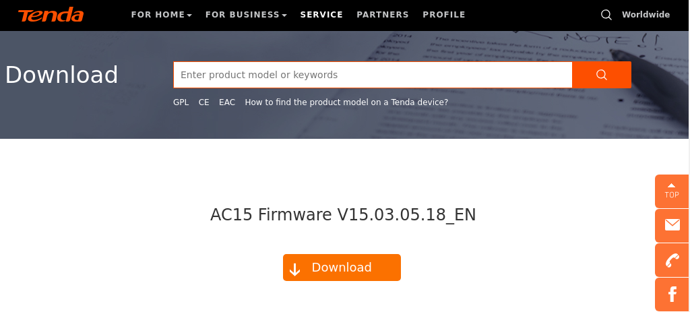

### 1.2 binwalk the firmware

Our goal is to "footprint" the firmware and eventually perform a baseline
static analysis of the extracted file system. We are looking for:

* Kernel version
* Kernel boot arguments
* The Root filesystem
* ...and any low hanging fruit we can find

```
# binwalk -e US_AC15V1.0BR_V15.03.05.18_multi_TD01.bin

DECIMAL       HEXADECIMAL     DESCRIPTION
--------------------------------------------------------------------------------
64            0x40            TRX firmware header, little endian,
                              image size: 10559488 bytes, CRC32: 0xFA817870,
                              flags: 0x0, version: 1, header size: 28 bytes,
                              loader offset: 0x1C, linux kernel offset: 0x1C9CD4,
                              rootfs offset: 0x0
92            0x5C            LZMA compressed data, properties: 0x5D,
                              dictionary size: 65536 bytes,
                              uncompressed size: 4585280 bytes
1875220       0x1C9D14        Squashfs filesystem, little endian, version 4.0,
                              compression:xz, size: 8680744 bytes, 926 inodes,
                              blocksize: 131072 bytes,
                              created: 2017-05-10 14:10:50
```
Contents of `_US_AC15V1.0BR_V15.03.05.18_multi_TD01.bin.extracted`:

```
-rw-r--r--    1 root     krafty     8680744 Jun  2 12:11 1C9D14.squashfs
-rw-r--r--    1 root     krafty     4585280 Jun  2 12:11 5C
-rw-r--r--    1 root     krafty    10559460 Jun  2 12:11 5C.7z
drwxr-xr-x   15 root     root          4096 May 10  2017 squashfs-root
```

Contents of `squashfs-root`:

```
drwxr-xr-x    2 root     root          4096 May 10  2017 bin
drwxr-xr-x    2 root     root          4096 May 10  2017 cfg
drwxr-xr-x    2 root     root          4096 May 10  2017 dev
lrwxrwxrwx    1 root     root             8 Jun  2 12:11 etc -> /var/etc
drwxr-xr-x    8 root     root          4096 May 10  2017 etc_ro
lrwxrwxrwx    1 root     root             9 Jun  2 12:11 home -> /var/home
lrwxrwxrwx    1 root     root            11 Jun  2 12:11 init -> bin/busybox
drwxr-xr-x    3 root     root          4096 May 10  2017 lib
drwxr-xr-x    2 root     root          4096 May 10  2017 mnt
drwxr-xr-x    2 root     root          4096 May 10  2017 proc
lrwxrwxrwx    1 root     root             9 Jun  2 12:11 root -> /var/root
drwxr-xr-x    2 root     root          4096 May 10  2017 sbin
drwxr-xr-x    2 root     root          4096 May 10  2017 sys
drwxr-xr-x    2 root     root          4096 May 10  2017 tmp
drwxr-xr-x    6 root     root          4096 May 10  2017 usr
drwxr-xr-x    6 root     root          4096 May 10  2017 var
lrwxrwxrwx    1 root     root            11 Jun  2 12:11 webroot -> var/webroot
drwxr-xr-x    8 root     root          4096 May 10  2017 webroot_ro
```
Strings dump of file `5C`:

```
:
root=/dev/mtdblock2 console=ttyS0,115200 init=init earlyprintk debug
:
Linux version 2.6.36.4brcmarm (root@linux-bkb8) (gcc version 4.5.3 (Buildroot 20
12.02) ) #1 SMP PREEMPT Wed May 10 21:54:27 CST 2017
%s version %s (root@linux-bkb8) (gcc version 4.5.3 (Buildroot 2012.02) ) %s
:
2.6.36.4brcmarm SMP preempt mod_unload modversions ARMv7
:
```
We now have the kernel version, boot arguments and contents of the root file
system.

### 1.3 Tracing our way through the init process

From the boot arguments, we see that the kernel invokes `/sbin/init` as the
first userland process after starting up. `init` in turn shall inspect
`/etc/inittab` and proceed with the userland portion of the startup accordingly.

`/etc/inittab` doesn't exist at boot time, however we realise that the `/etc_ro`
directory is copied over to `/etc/` at some point in the initialisation process.

Contents of `/etc_ro/inittab`:

```
::sysinit:/etc_ro/init.d/rcS
ttyS0::respawn:/sbin/sulogin
::ctrlaltdel:/bin/umount -a -r
::shutdown:/usr/sbin/wl radio off
::shutdown:/usr/sbin/wl -i eth2 radio off
```

The startup script `/etc_ro/init.d/rcS` performs the following actions:
```
:
cfmd &
echo '' > /proc/sys/kernel/hotplug
udevd &
logserver &

tendaupload &
if [ -e /etc/nginx/conf/nginx_init.sh ]; then
	sh /etc/nginx/conf/nginx_init.sh
fi

moniter &
telnetd &
:
```
1. Creates `ramfs` and mount points
2. Copies `/etc_ro` to `/etc`
3. Copies `/webroot_ro` to `/webroot`
4. Launches the startup daemons
5. The following daemons are started:
   - cfmd
   - udevd
   - logserver
   - tendaupload
   - moniter
   - telnetd

The startup process is summarised in the diagram below:

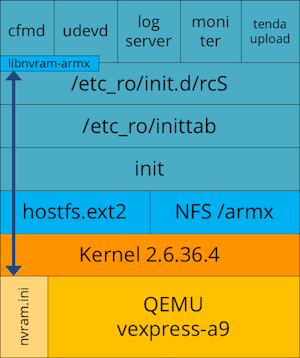

## Section 2 - Emulation attempt #1

To create a new ARM-X device, follow these steps:

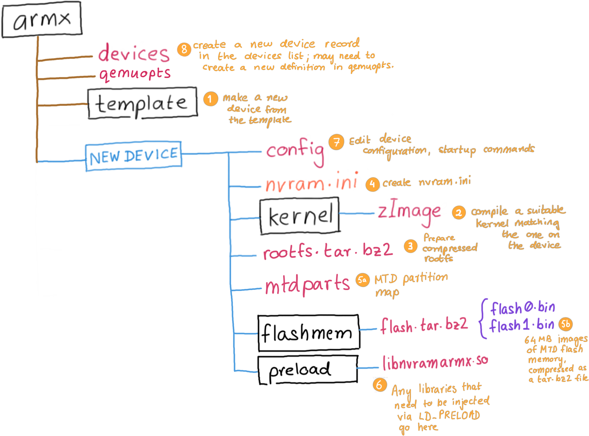

1. Create a device directory in ARM-X for the Tenda AC15.
2. Choose a kernel.
3. Copy the root file system into the device directory.
4. We shall leave `nvram.ini` untouched for now, since we don't have the nvram
contents.
5. Edit the device `config` file.
6. Create the Tenda record in `/armx/devices`

### 2.1 Creating the Tenda device directory

We will use the ID `TENDA` for Create a new device directory under `/armx` by
copying the `/armx/template` directory as `/armx/TENDA`:

```
$ cd /armx/
$ cp -r template TENDA
```

### 2.2 Choosing a kernel

I will choose kernel 2.6.39.4 as the base kernel for emulating the Tenda AC15.
This kernel is already included with the ARM-X release. I will describe how to
compile your own kernel (specifically version 2.6.36.4 to match the version
running on the router) in a separate article.

The kernel is present as `zImage-2.6.39.4-vexpress`.

### 2.3 Copy the root file system

Move the `squashfs-root` directory extracted by `binwalk` ([Section 1.2](#12-binwalk-the-firmware)) into
`/armx/TENDA/squashfs-root`.

### 2.4 nvram.ini

Since we do not have the contents of nvram, we shall leave `nvram.ini` as-is.
Later, we shall populate `nvram.ini` once we gain more insight into the Tenda
startup process.

### 2.5 Edit the config file

Contents of `/armx/TENDA/config`:

```
# Tenda AC15 ARM-X configuration
#
id=TENDA
nvram=nvram.ini
rootfs=squashfs-root
randomize_va_space=0
initcommands="/etc_ro/init.d/rcS;/bin/sh"
initpath=/etc_ro/armxinit
```
Note that the `initpath` has to be set to `/etc_ro/armxinit` instead of the
default `/etc/armxinit` because the `/etc` directory is a broken symlink when
the device starts up.

### 2.6 Create a record in /armx/devices

```
TENDA,qemu-system-arm-4.1.0,vexpress-a9,,,256M,zImage-2.6.39.4-vexpress,VEXPRESS2,Tenda AC15 Wi-Fi Router
```

### 2.7 Starting the Tenda AC15, attempt #1

The `/armx/TENDA` directory looks like:

```
/armx/TENDA
       |
       |--- config
       |--- kernel
       |      |
       |      `--- zImage-2.6.39.4-vexpress
       |
       |--- nvram.ini
       `--- squashfs-root
```

Start the ARM-X Launcher with the Tenda AC15 kernel


From the ARM-X Terminal, start the Tenda AC15 init scripts


Output: (few errors have been removed)

```
Starting Tenda AC15 Wi-Fi Router
Loading nvram from nvram.ini
key1='value1'
nv_get_config_data: Can't get config data
:      :
key10='value10'
>>> Starting TENDA
[+] chroot /armx/TENDA/squashfs-root /etc_ro/armxinit
mkdir: can't create directory '/var/run': File exists
init_core_dump 1816: rlim_cur = 0, rlim_max = 0
init_core_dump 1825: open core dump success
init_core_dump 1834: rlim_cur = 5242880, rlim_max = 5242880
func:InitCfm begin load_mib....
Could not open mtd device 2
[get_mtd_size] Can't open file:CFM
[get_mtd_size] Can't open file:CFM_BACKUP
malloc buf failed
load mib failed.
flash_to_file:open Policy failed.
going to rewrite flash...
open Policy failed.
rewrite flash ok...

######## STARTING PROGRAM #########
spawn-fcgi: child spawned successfully: PID: 683
~ # /dev/nvram: No such device

###########################################################
###nvram partition is destory, restore by default and reboot##
###########################################################
Could not open mtd device 1
envram_init: read flash error
/dev/nvram: No such device
load nvram from /webroot/nvram_default.cfg...
/dev/nvram: No such device
/dev/nvram: No such device

(Sometime after this the kernel reboots)
```

In summary, we have:

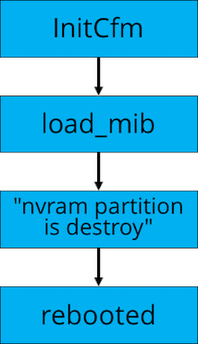

## Section 3 - Reverse Engineering with Ghidra

I used [Ghidra](https://ghidra-sre.org) to reverse engineer the binaries
invoked by `/etc_ro/init.d/rcS` along with various shared libraries found in
`/lib`

These are the functions I reversed in the first pass:

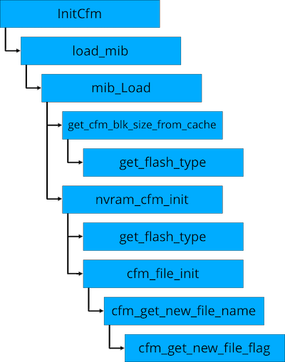

### 3.1 Code snippets from reversed functions - part 1

`InitCfm` was revealed from the startup messages.

```
int InitCfm(void)
{
    :
    printf("func:%s begin load_mib....\n","InitCfm");
    load_mib(0);     // next step
    :
}
```
and so was `load_mib`

```
int load_mib(int flags)
{
  :
  mib_open();
  iVar1 = mib_Load("/webroot/default.cfg",flags);     // important filename
  :
}
```

Inspection of `/webroot_ro/default.cfg` reveals that it stores the factory
default configuration of the AC15.

```
int mib_Load(char *filename,int flags)
{
  :
  iVar1 = get_cfm_blk_size_from_cache();
    :
    if ((flags != 0) || (flag_init = nvram_cfm_init(buf_00,iVar1 << 3), flag_init == 0)) {
    :
    :
}
```
Next, reverse `get_cfm_blk_size_from_cache` and `nvram_cfm_init`
```
int get_cfm_blk_size_from_cache(void)
{
  :
  iVar1 = get_flash_type();
  if (iVar1 == 4) {
    cfm_size_from_cache = 0x20000;
  }
  else {
    :
  }
  return cfm_size_from_cache;
}
```
Observation: `get_flash_type()`'s return value is checked to see if it is `4`

```
uint get_flash_type(void)
{
  int iVar1;
  uint uVar2;
  byte local_34 [32];
  int local_14;

  local_14 = mtd_open(&DAT_0002de2c,2);
  if (local_14 < 0) {
    fwrite("Could not open mtd device 2\n",1,0x1c,stderr);
    uVar2 = 0xffffffff;
  }
  else {
    iVar1 = ioctl(local_14,0x80204d01,local_34);
    if (iVar1 == 0) {
      close(local_14);
      uVar2 = (uint)local_34[0];
    }
    else {
      fwrite("Could not get mtd device info\n",1,0x1e,stderr);
      close(local_14);
      uVar2 = 0xffffffff;
    }
  }
  return uVar2;
}
```
Observation: In the absence of MTD emulation, it is imperative to fake
`get_flash_type() = 4`

### 3.2 Code snippets from reversed functions - part 2

Continuing with `nvram_cfm_init`

```
int nvram_cfm_init(char *buf,int len)
{
  :
  iVar1 = get_flash_type();
  if (iVar1 == 4) {
    ret = cfm_file_init(buf,len);
  }
  else {
    ret = cfm_mtd_init(buf);
  }
  return ret;
}
```
Observation: If `get_flash_type() == 4` then the code execution follows
`cfm_file_init` and not `cfm_mtd_init`. The latter would prove to be difficult
in the light of missing MTD hardware.

```
int cfm_file_init(char *buf,int len)
{
  :
  __fd = mount("/dev/mtdblock7","/cfg","jffs2",0,(void *)0x0);
  if (__fd != 0) {
    puts("Erase nflash MTD partition and mount again");
    system("/bin/flash_erase /dev/mtd7 0x0 0x0");
    __fd = mount("/dev/mtdblock7","/cfg","jffs2",0,(void *)0x0);
    if (__fd != 0) {
      printf("Mount nflash MTD jffs2 partition %s to %s failed\n","/dev/mtdblock7",&DAT_0001e984);
    }
  }
  pcVar1 = cfm_get_new_file_name();
  __file = pcVar1;
  if (pcVar1 == (char *)0x0) {
    __file = "/cfg/mib.cfg";
  }
  :
  : // long function
  :
}
```
Observation: `cfm_file_init` opens `/cfg/mib.cfg` for reading initial
configuration values, after mounting `/dev/mtdblock7` to `/cfg`.
```
char * cfm_get_new_file_name(void)
{
  :
  iVar1 = cfm_get_new_file_flag(&cfm_flag,"/cfg/mib.cfg");
  if (iVar1 == 0) {
    cfm_flag = 0;
  }
  iVar1 = cfm_get_new_file_flag(&cfm_backup_flag,"/cfg/mib_backup.cfg");
  if (iVar1 == 0) {
    cfm_backup_flag = 0;
  }
  :
}
```
Observation: `cfm_get_new_file_name` looks for `/cfg/mib.cfg` and
`/cfg/mib_backup.cfg`. Eventually we shall see that these files are created
by this function with configuration data populated from
`/webroot_ro/default.cfg`.
([3.1](#31-code-snippets-from-reversed-functions---part-1))

### 3.3 Error message "nvram partition is destroy"

From the startup messages, we see an error message `nvram partition is destroy`
flash past and thereafter the system reboots. Using Ghidra to search for this
error message leads us to `FUN_0000e640` in `cfmd`:

```
void FUN_0000e460(void)
{
  __s1 = (void *)bcm_nvram_get("default_nvram");
  if ((__s1 == (void *)0x0) || (iVar1 = memcmp(__s1,"default_nvram",0xd), iVar1 != 0)) {
    puts("\x1b[0;32;31m\n###########################################################");
    puts("###nvram partition is destory, restore by default and reboot##");
    printf("###########################################################\n\x1b[m");
    RestoreNvram();
    doSystemCmd("reboot");
  }
  return;
}
```
Observation: `FUN_0000e460` calls:
- `bcm_nvram_get` seems to be the way to access `nvram` data. This function
needs to be mapped to the equivalent nvram access functions
in `libnvram-armx.so`.
- `RestoreNvram` looks interesting
- `doSystemCmd("reboot")` this is where the reboot is triggered

### 3.4 bcm_nvram_ functions

```
char * bcm_nvram_get(char *name)
{
  :
  iVar2 = bcm_nvram_init((void *)0x0);
      :
      sVar3 = read(nvram_fd,off,__size);
  :
  return value;
}
```
Observation: in the absence of physican nvram, we need to map this function to
`nvram_get` in `libnvram-armx`
```
int bcm_nvram_init(void *unused)
{
  :
  if (nvram_fd < 0) {
    nvram_fd = open("/dev/nvram",2);
    if (-1 < nvram_fd) {
      nvram_buf = (char *)mmap((void *)0x0,0x10000,1,1,nvram_fd,0);
      if (nvram_buf != (char *)0xffffffff) {
        fcntl(nvram_fd,2,1);
        return 0;
      }
      close(nvram_fd);
      nvram_fd = -1;
    }
    perror("/dev/nvram");
    piVar1 = __errno_location();
    iVar2 = *piVar1;
  }
  :
}
```
Observation: All the `/dev/nvram` error messages are coming from here.
```
void RestoreNvram(void)
{
  envram_to_nvram();
  bcm_nvram_restore();
  return;
}
```

```
int bcm_nvram_restore(void)
{
  pcVar1 = bcm_nvram_get("image_boot");
  :
  __stream = fopen("/webroot/nvram_default.cfg","r");
  if (__stream != (FILE *)0x0) {
    printf("load nvram from %s...\n","/webroot/nvram_default.cfg");
    while (__src = fgets(mib_val,0x100,__stream), __src != (char *)0x0) {
        :
        bcm_nvram_set(mib_val,__src);
        memset(mib_val,0,0x100);
        :
    }
    fclose(__stream);
  }
  if (pcVar1 != (char *)0x0) {
    bcm_nvram_set("image_boot",imboot_value);
    bcm_nvram_commit();
  }
  bcm_nvram_set("default_nvram","default_nvram");
  iVar3 = bcm_nvram_commit();
  return iVar3;
}
```
Observation: If the system detects an empty nvram, `RestoreNvram` and
`bcm_nvram_restore` populates the nvram with values from
`/webroot_ro/nvram_default.cfg`.

## Section 4 - Emulation attempt #2 - hooked functions

To proceed with the emulation, it is necessary to:

1. map the following functions:
   - `bcm_nvram_set` to `nvram_get`
   - `bcm_nvram_get` to `nvram_set`
   - `bcm_nvram_unset` to `nvram_unset`
2. fake `get_flash_type` to always return `4`
3. populate the nvram with meaningful values

### 4.1 tenda_hooks.c

I wrote `tenda_hooks.c` along the same lines as my earlier work
[custom_nvram_r6250.c][nvram_r6250].

Source: https://github.com/therealsaumil/custom_nvram/blob/master/tenda_hooks.c

Pre-compiled `tenda_hooks.so` and `tenda_hooks_verbose.so` along with
`libnvram-armx.so` are available at
https://github.com/therealsaumil/custom_nvram/

### 4.2 Using tenda_hooks.so

To use these hooks, we need to `LD_PRELOAD` them before invoking
`/etc_ro/init.d/rcS`

The contents of `/armx/TENDA/config` are now as follows:

```
# Tenda AC15 ARM-X configuration
#
id=TENDA
nvram=
rootfs=squashfs-root
randomize_va_space=0
initcommands="export LD_PRELOAD=/lib/libnvram-armx.so:/lib/tenda_hooks_verbose.so;/etc_ro/init.d/rcS;/bin/sh"
initpath=/etc_ro/armxinit
```

### 4.3 Preparing for a limited emulation

My goal was to let `cfmd` run `FUN_0000e460()` successfully, so that
`RestoreNvram()` can complete its task in populating the nvram values. And I
wanted to grab the freshly populated nvram values before the router rebooted
from `doSystemCmd("reboot")`. as described in
[3.3](#33-error-message-nvram-partition-is-destroy)

First, we change `/sbin/reboot` as follows:
```
#!/bin/sh
echo "*** REBOOT INVOKED ***" > /dev/console
sleep 600
```
Next, we edit `/etc_ro/init.d/rcS` to prevent startup daemons subsequent to
`cfmd` from running:

```
:
chmod +x /etc/mdev.conf

cfmd &
read -p "*** cfmd started *** " # Pause
echo '' > /proc/sys/kernel/hotplug
udevd &
logserver &
:
```

### 4.4 Starting the Tenda AC15, attempt #2

1. Start the ARM-X Launcher with the Tenda AC15 kernel
2. From the ARM-X Terminal, start the Tenda AC15 init scripts

The startup output is as follows: (similar lines have been truncated)
```
Starting Tenda AC15 Wi-Fi Router
Syntax: ./run-init <ini file>
>>> Starting TENDA
[+] chroot /armx/TENDA/squashfs-root /etc_ro/armxinit
mkdir: can't create directory '/var/run': File exists
*** cfmd started *** init_core_dump 1816: rlim_cur = 0, rlim_max = 0
init_core_dump 1825: open core dump success
[0x400821bc] system('echo /tmp/core-%e-%p-%t-%s > /proc/sys/kernel/core_pattern') = 0
init_core_dump 1834: rlim_cur = 5242880, rlim_max = 5242880
func:InitCfm begin load_mib....
[0x40054598] get_flash_type() = 4
[0x400555b0] get_flash_type() = 4
Erase nflash MTD partition and mount again
flash_erase: error!: /dev/mtd7
	     error 2 (No such file or directory)
[0x400550dc] system('/bin/flash_erase /dev/mtd7 0x0 0x0') = 65280
Mount nflash MTD jffs2 partition /dev/mtdblock7 to /cfg failed
Failed to open persistent data file: /cfg/mib.cfg
open: No such file or directory
Failed to open persistent data file: /cfg/mib.cfg
open: No such file or directory
Failed to open persistent data file: (null)
open: No such file or directory
loading default config from /webroot/default.cfg file...
[0x400cb9b4] Can't open
nv_get_config_data: Can't get config data
bcm_nvram_get('et0macaddr') = ''
[0x400cb9b4] bcm_nvram_get('et0macaddr') = ''
[0x400cb9b4] bcm_nvram_get('et0macaddr') = ''
[0x400cb9b4] bcm_nvram_get('et0macaddr') = ''
[0x400cbbc4] bcm_nvram_get('1:macaddr') = ''
[0x400cbbdc] bcm_nvram_get('1:macaddr') = ''
get_wlan_mac 700: get macaddr from nvram error
 not exist!(mib.c restore_change_wifi_ssid)
Could not open mtd device 1
envram_init: read flash error
Could not open mtd device 1
envram_init: read flash error
Could not open mtd device 1
envram_init: read flash error
error power wl2g.power [rate:2]
Could not open mtd device 1
envram_init: read flash error
error power wl5g.power [rate:5]
flash_to_file:open Policy failed.
going to rewrite flash...
open Policy failed.
rewrite flash ok...
[0x0000e48c] bcm_nvram_get('default_nvram') = ''

###########################################################
###nvram partition is destory, restore by default and reboot##
###########################################################
Could not open mtd device 1
envram_init: read flash error
[0x40057834] bcm_nvram_get('image_boot') = ''
[0x40057854] bcm_nvram_get('image_boot') = ''
load nvram from /webroot/nvram_default.cfg...
[0x400579ec] [nvram 0] bcm_nvram_set('0:boardvendor', '0x14E4')
[0x400579ec] [nvram 0] bcm_nvram_set('0:ledbh10', '7')
[0x400579ec] [nvram 0] bcm_nvram_set('0:leddc', '0xffff')
[0x400579ec] [nvram 0] bcm_nvram_set('1:ledbh2', '7')
:            :         :
:            :         :
:            :         :
[0x400579ec] [nvram 0] bcm_nvram_set('wl_txbf_imp', '0')
[0x400579ec] [nvram 0] bcm_nvram_set('wl0_txbf_imp', '0')
[0x400579ec] [nvram 0] bcm_nvram_set('wl1_txbf_imp', '0')
[0x40057a70] [nvram 0] bcm_nvram_set('image_boot', '')
/dev/nvram: No such device
[0x40057a90] [nvram 0] bcm_nvram_set('default_nvram', 'default_nvram')
/dev/nvram: No such device
[0x400821bc] system('reboot') = 2
```
There are around 1000+ `bcm_nvram_set()` calls, all triggered by `RestoreNvram`.
The emulation is paused at this point. It seems our nvram will now contain
meaningful values.

### 4.5 Creating nvram_AC15.ini

To grab the nvram contents populated by `RestoreNvram`, open the ARM-X
HOSTFS Shell from the ARM-X terminal, and run the following:

```
ARM-X HOSTFS [TENDA]:~> nvram show > /armx/TENDA/nvram_AC15.ini
```
As an aside, the `/cfg` directory is still empty. At some point, it will get
populated with `mib.cfg` as observed in
[3.2](#32-code-snippets-from-reversed-functions---part-2)

## Section 5 - The Emulated Tenda AC15

Armed with working data in `nvram_AC15.ini`, we can attempt to run the full
emulation.

Before we proceed, we need to restore `/sbin/reboot` and `/etc_ro/init.d/rcS`
to their original versions.

### 5.1 Starting the Tenda AC15, attempt #3

Set the `nvram=` parameter in `/armx/TENDA/config` as follows:

```
# Tenda AC15 ARM-X configuration
#
id=TENDA
nvram=nvram_AC15.ini
rootfs=squashfs-root
randomize_va_space=0
initcommands="export LD_PRELOAD=/lib/libnvram-armx.so:/lib/tenda_hooks_verbose.so;/etc_ro/init.d/rcS;/bin/sh"
initpath=/etc_ro/armxinit
```

Start the emulation once again as follows:

1. Start the ARM-X Launcher with the Tenda AC15 kernel
2. From the ARM-X Terminal, start the Tenda AC15 init scripts

The startup process continues past `cfmd`. The system does not reboot. A
condensed version of the output (with only the relevant parts) is shown below:

```
Starting Tenda AC15 Wi-Fi Router
Loading nvram from nvram_fresh.ini
0:boardvendor='0x14E4'
Can't open
nv_get_config_data: Can't get config data
0:ledbh10='7'
0:leddc='0xffff'
1:ledbh2='7'
:    :
:    :
wl0_txbf_imp='0'
wl1_txbf_imp='0'
default_nvram='default_nvram'
vlan2ports='0  5'
vlan1ports='1  2  3  4	5*'
>>> Starting TENDA
[+] chroot /armx/TENDA/squashfs-root /etc_ro/armxinit
mkdir: can't create directory '/var/run': File exists
init_core_dump 1816: rlim_cur = 0, rlim_max = 0
init_core_dump 1825: open core dump success
init_core_dump 1834: rlim_cur = 5242880, rlim_max = 5242880
func:InitCfm begin load_mib....
[0x40054598] get_flash_type() = 4
[0x400555b0] get_flash_type() = 4
Erase nflash MTD partition and mount again

######## STARTING PROGRAM #########
flash_erase: error!: /dev/mtd7
	     error 2 (No such file or directory)
[0x400550dc] system('/bin/flash_erase /dev/mtd7 0x0 0x0') = 65280
Mount nflash MTD jffs2 partition /dev/mtdblock7 to /cfg failed
crc = b5fad1ed, newcrc = b5fad1ed
spawn-fcgi: child spawned successfully: PID: 1492
~ # [0x40054598] get_flash_type() = 4
[0x40054598] get_flash_type() = 4
flash_to_file:open Policy failed.
going to rewrite flash...
open Policy failed.
rewrite flash ok...
:       :
:       :
[0x400821bc] system('ifconfig br0 hw ether 00:01:02:03:04:05') = 256
[0x400821bc] system('ifconfig vlan1 up') = 0
[0x400821bc] system('brctl addbr br0') = 0
[0x400821bc] system('brctl setfd br0 0') = 0
[0x400821bc] system('brctl stp br0 on') = 0
[0x400821bc] system('brctl addif br0 vlan1') = 0
[0x400821bc] system('ifconfig br0 up') = 0
[0x400821bc] system('ifconfig br0 192.168.0.1 netmask 255.255.255.0 ') = 0
Sat Jan	 1 00:00:00 UTC 2000
:       :
:       :
iptables: goahead: 4: main----51

goahead: 4: initPlatform----398

goahead: 4: websOpen----233
```

The system starts up. Looking at some of the `system()` commands from the output
above, we observe that a Bridge Interface `br0` has been created and assigned
the IP address `192.168.0.1`. We can inspect the network interfaces and
listening ports from the ARM-X HOSTFS Shell:

```
ARM-X HOSTFS [TENDA]:~> ifconfig -a
:         :
br0       Link encap:Ethernet  HWaddr 52:54:00:12:34:56  
          inet addr:192.168.0.1  Bcast:192.168.0.255  Mask:255.255.255.0
          inet6 addr: fe80::1/64 Scope:Link
          UP BROADCAST RUNNING MULTICAST  MTU:1500  Metric:1
          RX packets:0 errors:0 dropped:0 overruns:0 frame:0
          TX packets:17 errors:0 dropped:0 overruns:0 carrier:0
          collisions:0 txqueuelen:0
          RX bytes:0 (0.0 B)  TX bytes:3388 (3.3 KiB)

br0:dname Link encap:Ethernet  HWaddr 52:54:00:12:34:56  
          inet addr:172.17.245.103  Bcast:172.17.255.255  Mask:255.255.255.255
          UP BROADCAST RUNNING MULTICAST  MTU:1500  Metric:1

eth0      Link encap:Ethernet  HWaddr 52:54:00:12:34:56  
          inet addr:192.168.100.2  Bcast:0.0.0.0  Mask:255.255.255.0
          inet6 addr: fe80::5054:ff:fe12:3456/64 Scope:Link
          UP BROADCAST RUNNING MULTICAST  MTU:1500  Metric:1
          RX packets:23660 errors:0 dropped:0 overruns:0 frame:0
          TX packets:21755 errors:0 dropped:0 overruns:0 carrier:0
          collisions:0 txqueuelen:1000
          RX bytes:19665957 (18.7 MiB)  TX bytes:3404166 (3.2 MiB)
:         :
```
Listening ports:
```
ARM-X HOSTFS [TENDA]:~> netstat -nat
Active Internet connections (servers and established)
Proto Recv-Q Send-Q Local Address           Foreign Address         State       
tcp        0      0 0.0.0.0:9000            0.0.0.0:*               LISTEN      
tcp        0      0 172.17.245.103:80       0.0.0.0:*               LISTEN      
tcp        0      0 192.168.0.1:80          0.0.0.0:*               LISTEN      
tcp        0      0 127.0.0.1:10002         0.0.0.0:*               LISTEN      
tcp        0      0 127.0.0.1:10003         0.0.0.0:*               LISTEN      
tcp        0      0 0.0.0.0:10004           0.0.0.0:*               LISTEN      
tcp        0      0 0.0.0.0:8180            0.0.0.0:*               LISTEN      
tcp        0      0 0.0.0.0:22              0.0.0.0:*               LISTEN      
tcp        0      0 0.0.0.0:5500            0.0.0.0:*               LISTEN      
tcp        0      0 127.0.0.1:8188          0.0.0.0:*               LISTEN      
tcp        0      0 127.0.0.1:10004         127.0.0.1:45174         ESTABLISHED
tcp        0      0 127.0.0.1:56915         127.0.0.1:10003         ESTABLISHED
tcp        0      0 127.0.0.1:10003         127.0.0.1:56915         ESTABLISHED
tcp        0      0 192.168.100.2:838       192.168.100.1:2049      ESTABLISHED
tcp        0      0 192.168.100.2:22        192.168.100.1:34216     ESTABLISHED
tcp        0      0 127.0.0.1:45174         127.0.0.1:10004         ESTABLISHED
tcp        0      0 192.168.100.2:22        192.168.100.1:34218     ESTABLISHED
tcp        0      0 :::22                   :::*                    LISTEN      
tcp        0      0 :::23                   :::*                    LISTEN
```
Running processes:
```
ARM-X HOSTFS [TENDA]:~> ps ax
:    :        :
1880 root     cfmd
1881 root     cfmd
1882 root     netctrl
1883 root     time_check
1884 root     httpd
1885 root     multiWAN
1886 root     ucloud_v2 -l 4
1887 root     business_proc -l 4
1890 root     time_check
1892 root     time_check
1903 root     business_proc -l 4
1904 root     business_proc -l 4
1905 root     ucloud_v2 -l 4
1922 root     netctrl
1923 root     netctrl
:    :        :
```
The webserver `httpd` is indeed running, however it is inaccessible due to the
IP address of the network interface it is bound to (`br0`).

### 5.2 Fixing the "factory defaults"

As discussed in [3.1](#31-code-snippets-from-reversed-functions---part-1) the
factory defaults are be loaded from `mib_Load("/webroot/default.cfg", flags)`

Inspecting `/webroot_ro/default.cfg` reveals the `lan.ip` parameter which is
set as follows:

```
lan.ip=192.168.0.1
```

We also notice files `/cfg/mib.cfg` and `/cfg/mib_backup.cfg` are freshly
created.

To change the default IP address to `192.168.100.2` as hardcoded in ARM-X,
I edited the `/webroot_ro/default.cfg` file:

```
lan.ip=192.168.100.2^M
lan.mask=255.255.255.0^M
```

I also erased `/cfg/mib.cfg` and `/cfg/mib_backup.cfg`.

### 5.3 Starting the Tenda AC15, final attempt

Now that our observations are complete, we can switch from `tenda_hooks_verbose`
to `tenda_hooks`, to avoid excessive output. All we want to verify is the IP
address should be set to `192.168.100.2` and that the web server should be
accessible from a browser.

Edit `/armx/TENDA/config`:

```
# Tenda AC15 ARM-X configuration
#
id=TENDA
nvram=nvram_AC15.ini
rootfs=squashfs-root
randomize_va_space=0
initcommands="export LD_PRELOAD=/lib/libnvram-armx.so:/lib/tenda_hooks.so;/etc_ro/init.d/rcS;/bin/sh"
initpath=/etc_ro/armxinit
```

Start the emulation once again as follows:

1. Start the ARM-X Launcher with the Tenda AC15 kernel
2. From the ARM-X Terminal, start the Tenda AC15 init scripts

One by one all the services and daemons start up.

Checking the IP address of `br0`:
```
ARM-X HOSTFS [TENDA]:~> ifconfig br0
br0       Link encap:Ethernet  HWaddr 52:54:00:12:34:56  
         inet addr:192.168.100.2  Bcast:192.168.100.255  Mask:255.255.255.0
         inet6 addr: fe80::1/64 Scope:Link
         UP BROADCAST RUNNING MULTICAST  MTU:1500  Metric:1
         RX packets:0 errors:0 dropped:0 overruns:0 frame:0
         TX packets:50 errors:0 dropped:0 overruns:0 carrier:0
         collisions:0 txqueuelen:0
         RX bytes:0 (0.0 B)  TX bytes:14282 (13.9 KiB)
```
Checking the listening ports:
```
ARM-X HOSTFS [TENDA]:~> netstat -nat
Active Internet connections (servers and established)
Proto Recv-Q Send-Q Local Address           Foreign Address         State       
tcp        0      0 0.0.0.0:9000            0.0.0.0:*               LISTEN      
tcp        0      0 172.17.245.103:80       0.0.0.0:*               LISTEN      
tcp        0      0 192.168.100.2:80        0.0.0.0:*               LISTEN      
tcp        0      0 127.0.0.1:10002         0.0.0.0:*               LISTEN      
tcp        0      0 127.0.0.1:10003         0.0.0.0:*               LISTEN      
tcp        0      0 0.0.0.0:10004           0.0.0.0:*               LISTEN      
tcp        0      0 0.0.0.0:8180            0.0.0.0:*               LISTEN      
tcp        0      0 0.0.0.0:22              0.0.0.0:*               LISTEN      
tcp        0      0 0.0.0.0:5500            0.0.0.0:*               LISTEN      
tcp        0      0 127.0.0.1:8188          0.0.0.0:*               LISTEN      
tcp        0      0 192.168.100.2:22        192.168.100.1:51948     ESTABLISHED
tcp        0      0 127.0.0.1:10004         127.0.0.1:54956         ESTABLISHED
tcp        0      0 127.0.0.1:52552         127.0.0.1:10003         ESTABLISHED
tcp        0      0 192.168.100.2:22        192.168.100.1:51952     ESTABLISHED
tcp        0      0 192.168.100.2:988       192.168.100.1:2049      ESTABLISHED
tcp        0      0 127.0.0.1:10003         127.0.0.1:52552         ESTABLISHED
tcp        0      0 127.0.0.1:54956         127.0.0.1:10004         ESTABLISHED
tcp        0      0 :::22                   :::*                    LISTEN      
tcp        0      0 :::23                   :::*                    LISTEN
```

### 5.4 Process Memory Layout

One of the goals of ARM-X is to create an emulated process memory layout
identical to that on the actual hardware. This allows us to guarantee that
memory corruption exploits created on the emulated environment work as-is when
targeting the actual hardware.

Presented below is a comparision of the memory layout of the `httpd` process:

```
attackbox:~$ armxmaps httpd
00008000-000f7000 r-xp 00000000 00:0f 278680     /armx/TENDA/squashfs-root/bin/httpd
000ff000-00102000 rw-p 000ef000 00:0f 278680     /armx/TENDA/squashfs-root/bin/httpd
00102000-00124000 rw-p 00000000 00:00 0          [heap]
40000000-40005000 r-xp 00000000 00:0f 278830     /armx/TENDA/squashfs-root/lib/ld-uClibc.so.0
40005000-40006000 rw-p 00000000 00:00 0
40007000-40008000 rw-p 00000000 00:00 0
4000c000-4000d000 r--p 00004000 00:0f 278830     /armx/TENDA/squashfs-root/lib/ld-uClibc.so.0
4000d000-4000e000 rw-p 00005000 00:0f 278830     /armx/TENDA/squashfs-root/lib/ld-uClibc.so.0
4000e000-40015000 r-xp 00000000 00:0f 137945     /armx/TENDA/squashfs-root/lib/libnvram-armx.so
40015000-4001c000 ---p 00000000 00:00 0
4001c000-4001d000 rw-p 00006000 00:0f 137945     /armx/TENDA/squashfs-root/lib/libnvram-armx.so
4001d000-40025000 rw-p 00000000 00:00 0
40025000-40026000 r-xp 00000000 00:0f 137935     /armx/TENDA/squashfs-root/lib/tenda_hooks.so
40026000-4002d000 ---p 00000000 00:00 0
4002d000-4002e000 rw-p 00000000 00:0f 137935     /armx/TENDA/squashfs-root/lib/tenda_hooks.so
4002e000-4003d000 r-xp 00000000 00:0f 278831     /armx/TENDA/squashfs-root/lib/libCfm.so
4003d000-40045000 ---p 00000000 00:00 0
40045000-40046000 rw-p 0000f000 00:0f 278831     /armx/TENDA/squashfs-root/lib/libCfm.so
40046000-40061000 rw-p 00000000 00:00 0
40061000-40081000 r-xp 00000000 00:0f 278841     /armx/TENDA/squashfs-root/lib/libcommon.so
40081000-40088000 ---p 00000000 00:00 0
40088000-40089000 rw-p 0001f000 00:0f 278841     /armx/TENDA/squashfs-root/lib/libcommon.so
40089000-40091000 rw-p 00000000 00:00 0
40091000-40099000 r-xp 00000000 00:0f 278832     /armx/TENDA/squashfs-root/lib/libChipApi.so
40099000-400a0000 ---p 00000000 00:00 0
400a0000-400a1000 rw-p 00007000 00:0f 278832     /armx/TENDA/squashfs-root/lib/libChipApi.so
400a1000-400a3000 r-xp 00000000 00:0f 278868     /armx/TENDA/squashfs-root/lib/libvos_util.so
400a3000-400ab000 ---p 00000000 00:00 0
400ab000-400ac000 rw-p 00002000 00:0f 278868     /armx/TENDA/squashfs-root/lib/libvos_util.so
400ac000-400c0000 r-xp 00000000 00:0f 278869     /armx/TENDA/squashfs-root/lib/libz.so
400c0000-400c7000 ---p 00000000 00:00 0
400c7000-400c9000 rw-p 00013000 00:0f 278869     /armx/TENDA/squashfs-root/lib/libz.so
400c9000-400d4000 r-xp 00000000 00:0f 278858     /armx/TENDA/squashfs-root/lib/libpthread.so.0
400d4000-400db000 ---p 00000000 00:00 0
400db000-400dc000 r--p 0000a000 00:0f 278858     /armx/TENDA/squashfs-root/lib/libpthread.so.0
400dc000-400e1000 rw-p 0000b000 00:0f 278858     /armx/TENDA/squashfs-root/lib/libpthread.so.0
400e1000-400e3000 rw-p 00000000 00:00 0
400e3000-400e4000 r-xp 00000000 00:0f 278855     /armx/TENDA/squashfs-root/lib/libnvram.so
400e4000-400eb000 ---p 00000000 00:00 0
400eb000-400ec000 rw-p 00000000 00:0f 278855     /armx/TENDA/squashfs-root/lib/libnvram.so
400ec000-400f9000 r-xp 00000000 00:0f 278861     /armx/TENDA/squashfs-root/lib/libshared.so
400f9000-40101000 ---p 00000000 00:00 0
40101000-40102000 rw-p 0000d000 00:0f 278861     /armx/TENDA/squashfs-root/lib/libshared.so
40102000-40168000 r-xp 00000000 00:0f 278863     /armx/TENDA/squashfs-root/lib/libtpi.so
40168000-4016f000 ---p 00000000 00:00 0
4016f000-40170000 rw-p 00065000 00:0f 278863     /armx/TENDA/squashfs-root/lib/libtpi.so
40170000-401a2000 rw-p 00000000 00:00 0
401a2000-401b1000 r-xp 00000000 00:0f 278852     /armx/TENDA/squashfs-root/lib/libm.so.0
401b1000-401b9000 ---p 00000000 00:00 0
401b9000-401ba000 r--p 0000f000 00:0f 278852     /armx/TENDA/squashfs-root/lib/libm.so.0
401ba000-401bb000 rw-p 00010000 00:0f 278852     /armx/TENDA/squashfs-root/lib/libm.so.0
401bb000-401e4000 r-xp 00000000 00:0f 278864     /armx/TENDA/squashfs-root/lib/libucapi.so
401e4000-401ec000 ---p 00000000 00:00 0
401ec000-401ed000 rw-p 00029000 00:0f 278864     /armx/TENDA/squashfs-root/lib/libucapi.so
401ed000-401ef000 rw-p 00000000 00:00 0
401ef000-401f9000 r-xp 00000000 00:0f 278849     /armx/TENDA/squashfs-root/lib/libgcc_s.so.1
401f9000-40200000 ---p 00000000 00:00 0
40200000-40201000 rw-p 00009000 00:0f 278849     /armx/TENDA/squashfs-root/lib/libgcc_s.so.1
40201000-40266000 r-xp 00000000 00:0f 278839     /armx/TENDA/squashfs-root/lib/libc.so.0
40266000-4026e000 ---p 00000000 00:00 0
4026e000-4026f000 r--p 00065000 00:0f 278839     /armx/TENDA/squashfs-root/lib/libc.so.0
4026f000-40270000 rw-p 00066000 00:0f 278839     /armx/TENDA/squashfs-root/lib/libc.so.0
40270000-40275000 rw-p 00000000 00:00 0
40275000-40277000 r-xp 00000000 00:0f 278845     /armx/TENDA/squashfs-root/lib/libdl.so.0
40277000-4027e000 ---p 00000000 00:00 0
4027e000-4027f000 r--p 00001000 00:0f 278845     /armx/TENDA/squashfs-root/lib/libdl.so.0
4027f000-40280000 rw-p 00000000 00:00 0
40280000-40281000 r-xp 00000000 00:0f 278860     /armx/TENDA/squashfs-root/lib/librt.so.0
40281000-40288000 ---p 00000000 00:00 0
40288000-40289000 r--p 00000000 00:0f 278860     /armx/TENDA/squashfs-root/lib/librt.so.0
befdf000-bf000000 rw-p 00000000 00:00 0          [stack]
ffff0000-ffff1000 r-xp 00000000 00:00 0          [vectors]
```
Comparing it with the process memory layout on the actual hardware
(deliberately non-randomized)
```
~ # cat /proc/4388/maps
00008000-000f7000 r-xp 00000000 1f:03 289        /bin/httpd
000ff000-00102000 rw-p 000ef000 1f:03 289        /bin/httpd
00102000-00124000 rw-p 00000000 00:00 0          [heap]
40000000-40005000 r-xp 00000000 1f:03 124        /lib/ld-uClibc.so.0
40005000-40006000 rw-p 00000000 00:00 0
40007000-40008000 rw-p 00000000 00:00 0
4000c000-4000d000 r--p 00004000 1f:03 124        /lib/ld-uClibc.so.0
4000d000-4000e000 rw-p 00005000 1f:03 124        /lib/ld-uClibc.so.0
4000e000-4001d000 r-xp 00000000 1f:03 192        /lib/libCfm.so
4001d000-40025000 ---p 00000000 00:00 0
40025000-40026000 rw-p 0000f000 1f:03 192        /lib/libCfm.so
40026000-40041000 rw-p 00000000 00:00 0
40041000-40061000 r-xp 00000000 1f:03 205        /lib/libcommon.so
40061000-40068000 ---p 00000000 00:00 0
40068000-40069000 rw-p 0001f000 1f:03 205        /lib/libcommon.so
40069000-40071000 rw-p 00000000 00:00 0
40071000-40079000 r-xp 00000000 1f:03 201        /lib/libChipApi.so
40079000-40080000 ---p 00000000 00:00 0
40080000-40081000 rw-p 00007000 1f:03 201        /lib/libChipApi.so
40081000-40083000 r-xp 00000000 1f:03 209        /lib/libvos_util.so
40083000-4008b000 ---p 00000000 00:00 0
4008b000-4008c000 rw-p 00002000 1f:03 209        /lib/libvos_util.so
4008c000-400a0000 r-xp 00000000 1f:03 211        /lib/libz.so
400a0000-400a7000 ---p 00000000 00:00 0
400a7000-400a9000 rw-p 00013000 1f:03 211        /lib/libz.so
400a9000-400b4000 r-xp 00000000 1f:03 191        /lib/libpthread.so.0
400b4000-400bb000 ---p 00000000 00:00 0
400bb000-400bc000 r--p 0000a000 1f:03 191        /lib/libpthread.so.0
400bc000-400c1000 rw-p 0000b000 1f:03 191        /lib/libpthread.so.0
400c1000-400c3000 rw-p 00000000 00:00 0
400c3000-400c4000 r-xp 00000000 1f:03 121        /lib/libnvram.so
400c4000-400cb000 ---p 00000000 00:00 0
400cb000-400cc000 rw-p 00000000 1f:03 121        /lib/libnvram.so
400cc000-400d9000 r-xp 00000000 1f:03 190        /lib/libshared.so
400d9000-400e1000 ---p 00000000 00:00 0
400e1000-400e2000 rw-p 0000d000 1f:03 190        /lib/libshared.so
400e2000-40148000 r-xp 00000000 1f:03 188        /lib/libtpi.so
40148000-4014f000 ---p 00000000 00:00 0
4014f000-40150000 rw-p 00065000 1f:03 188        /lib/libtpi.so
40150000-40182000 rw-p 00000000 00:00 0
40182000-40191000 r-xp 00000000 1f:03 118        /lib/libm.so.0
40191000-40199000 ---p 00000000 00:00 0
40199000-4019a000 r--p 0000f000 1f:03 118        /lib/libm.so.0
4019a000-4019b000 rw-p 00010000 1f:03 118        /lib/libm.so.0
4019b000-401c4000 r-xp 00000000 1f:03 119        /lib/libucapi.so
401c4000-401cc000 ---p 00000000 00:00 0
401cc000-401cd000 rw-p 00029000 1f:03 119        /lib/libucapi.so
401cd000-401cf000 rw-p 00000000 00:00 0
401cf000-401d9000 r-xp 00000000 1f:03 187        /lib/libgcc_s.so.1
401d9000-401e0000 ---p 00000000 00:00 0
401e0000-401e1000 rw-p 00009000 1f:03 187        /lib/libgcc_s.so.1
401e1000-40246000 r-xp 00000000 1f:03 203        /lib/libc.so.0
40246000-4024e000 ---p 00000000 00:00 0
4024e000-4024f000 r--p 00065000 1f:03 203        /lib/libc.so.0
4024f000-40250000 rw-p 00066000 1f:03 203        /lib/libc.so.0
40250000-40255000 rw-p 00000000 00:00 0
40255000-40256000 r-xp 00000000 1f:03 213        /lib/librt.so.0
40256000-4025d000 ---p 00000000 00:00 0
4025d000-4025e000 r--p 00000000 1f:03 213        /lib/librt.so.0
befdf000-bf000000 rw-p 00000000 00:00 0          [stack]
```
The addresses of libraries such as `libc.so.0` and others in ARM-X are slightly
different when compared to those on the actual hardware. The reason is because
of `/lib/libnvram-armx.so` and `tenda_hooks.so` being injected via `LD_PRELOAD`.

Apart from the preloaded libraries, everything else matches.

### 5.5 Interacting with the Tenda's web interface

1. Open the browser and navigate to `http://192.168.100.2`. We are greeted by
the Tenda Quick Setup Wizard

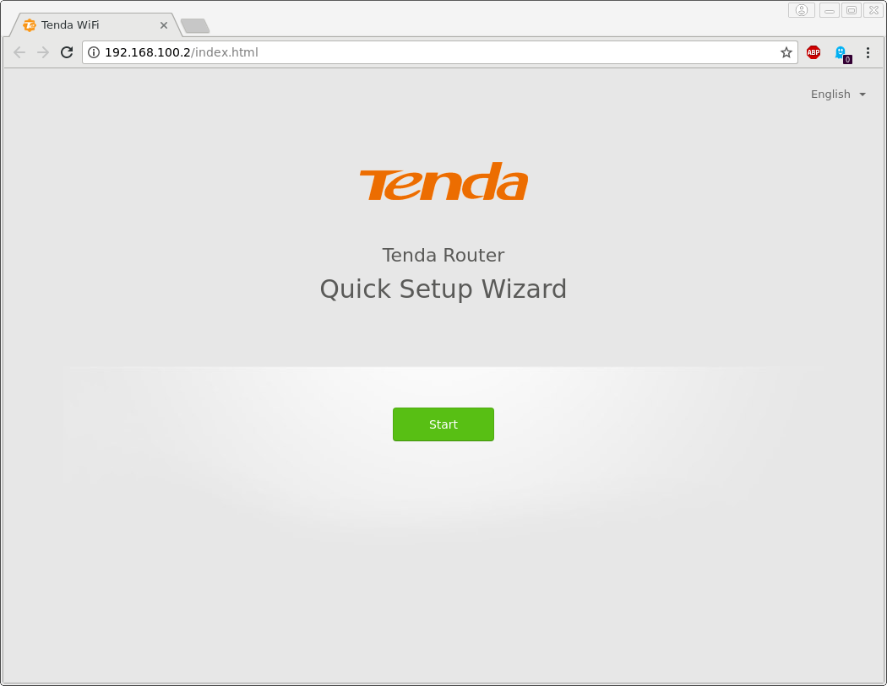

2. Skip connecting the WAN cable

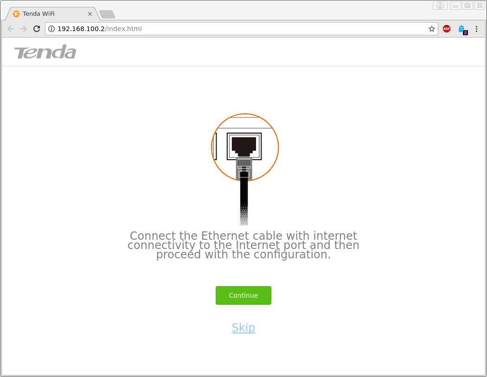

3. Set the login password. The password for the Tenda emulated instance on the
[ARM-X Preview VM][PreviewVM] is `ringzer0`

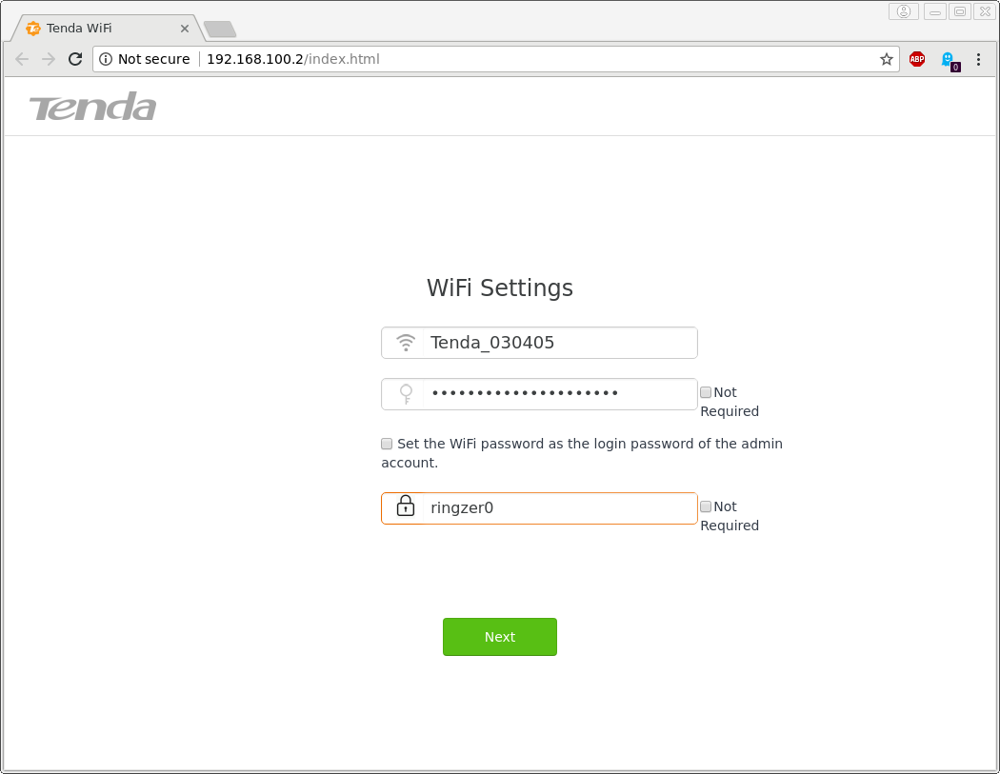

4. Login to the Web Administration Interface with password `ringzer0`


5. Enjoy!


## Concluding thoughts

This article was intended to familiarise you with what it takes to emulate a
new device from scratch. I urge you to download the [ARM-X Preview VM][PreviewVM]
and play with the emulated Tenda AC15.

For those of you who want to learn about IoT exploitation, take this as a
challenge and discover vulnerabilities on the AC15. Try to reproduce some
existing CVE's against the emulated AC15, or find 0-days on your own!

### Upcoming articles
- [Extracting the Tenda AC15's firmware directly from its SPI Flash chip][fw-extraction], and
- Exploiting the vast array of vulnerabilities present in the AC15.

Follow me on Twitter *[@therealsaumil][saumil]* for updates on [ARM-X][armx],
new articles, talks and trainings!

### BX LR

[R0ARM]: https://ringzer0.training/arm-iot-firmwarelab.html
[nvram_r6250]: https://github.com/therealsaumil/custom_nvram/blob/master/custom_nvram_r6250.c
[armx]: https://armx.exploitlab.net/
[PreviewVM]: https://armx.exploitlab.net/#downloads
[saumil]: https://twitter.com/therealsaumil
[fw-extraction]: extracting-tenda-ac15-firmware.html
