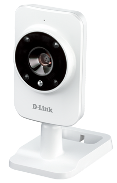
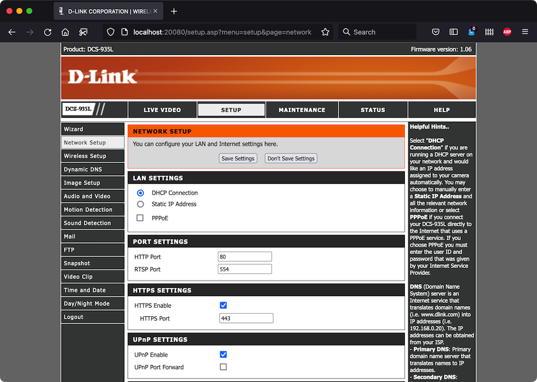

# Tutorial - Emulating the DLINK DCS-935L IP Camera with EMUX

by Saumil Shah [@therealsaumil][saumil]
with major contributions from [@bl4ckh0l3z][blackholes]

[saumil]: https://twitter.com/therealsaumil
[blackholes]: https://twitter.com/bl4ckh0l3z

April 2022

## Summary

Emulating the [D-Link DCS-935L WiFi Camera](https://www.dlink.com.au/home-solutions/DCS-935L-hd-wireless-AC600-day-night-cube-cloud-network-camera) with EMUX was fairly straightforward.



Follow these simple steps to get a virtual instance of the DCS-935L Camera working in EMUX:

* Download the firmware from D-Link's site
* Extract the `rootfs` and `kernel` partitions
* Choose a matching kernel for use with QEMU's Malta MIPS Big Endian board
* Putting it all together in EMUX
* Starting up the DCS-935L

In the end, you should have a working emulated instance of D-Link DCS-935L WiFi Camera!

If you haven't installed EMUX already, please follow the steps outlined at https://emux.exploitlab.net/

## Starting EMUX

First, start the EMUX docker instance:

```
./run-emux-docker

:
:
[+] Setting up forwarded ports 20080:80,20443:443,28080:8080,24433:4433,9999:9999
[+] mapping port 20080 -> 192.168.100.2:80
[+] mapping port 20443 -> 192.168.100.2:443
[+] mapping port 28080 -> 192.168.100.2:8080
[+] mapping port 24433 -> 192.168.100.2:4433
[+] mapping port 9999 -> 192.168.100.2:9999
  ___ __  __ _   __  __
 / __|  \/  | | |\ \/ /   by Saumil Shah | The Exploit Laboratory
 | __| |\/| | |_| )  (    @therealsaumil | emux.exploitlab.net
 \___|_|  |__\___/_/\_\

[EMUX-DOCKER 🐳] ~$
```
We will leave this terminal as-is, for now.

Next, open another terminal and attach to the EMUX docker container:

```
./emux-docker-shell

[emux-docker 🐚] ~$
```

You may have multiple shells open, for convenience. You are ready for the next step.

## Obtaining the Firmware

Download the firmware from [D-Link's website](https://files.dlink.com.au/products/DCS-935L/REV_A/Firmware/DCS-935L_FW_1.06.02/DCS-935L_A1_FW_1.06.02_20150717_r3108.bin). Note, the product is discontinued. It is uncertain how long these firmware files will be available on the support site.

```
[emux-docker 🐚] ~$ cd /tmp
[emux-docker 🐚] /tmp$ wget "https://files.dlink.com.au/products/DCS-935L/REV_A/Firmware/DCS-935L_FW_1.06.02/DCS-935L_A1_FW_1.06.02_20150717_r3108.bin"
```

## Extracting the firmware - kernel and rootfs

Use `binwalk` to extract the firmware in the `/tmp` directory.
```
[emux-docker 🐚] /tmp$ sudo binwalk --extract --preserve-symlinks --run-as=root DCS-935L_A1_FW_1.06.02_20150717_r3108.bin

DECIMAL       HEXADECIMAL     DESCRIPTION
--------------------------------------------------------------------------------
10264         0x2818          LZMA compressed data, properties: 0x5D, dictionary size: 16777216 bytes, uncompressed size: 4633120 bytes
1431586       0x15D822        Squashfs filesystem, little endian, version 4.0, compression:lzma, size: 5886558 bytes, 1401 inodes, blocksize: 131072 bytes, created: 2038-07-06 00:44:48

```

The extracted contents will be in the `_DCS-935L_A1_FW_1.06.02_20150717_r3108.bin.extracted` directory.

```
[emux-docker 🐚] /tmp$ cd _DCS-935L_A1_FW_1.06.02_20150717_r3108.bin.extracted/
[emux-docker 🐚] /tmp/_DCS-935L_A1_FW_1.06.02_20150717_r3108.bin.extracted$ ls
```

This is what we get:

* `2818.7z` - kernel partition
* `15D822.squashfs` - rootfs partition (SquashFS compressed file system)
* `2818` - uncompressed kernel
* `squashfs-root/` - unsquashfs'ed rootfs file system

Let us check the contents of `squashfs-root`.

```
[emux-docker 🐚] /tmp/_DCS-935L_A1_FW_1.06.02_20150717_r3108.bin.extracted$ ls -la squashfs-root

drwxr-xr-x 18 root root  4096 Jul 17  2015 ./
drwxr-xr-x  3 root root  4096 Apr 29 07:19 ../
drwxr-xr-x  2 root root  4096 Jul 17  2015 bin/
drwxr-xr-x  3 root root 12288 Jul 17  2015 dev/
drwxr-xr-x  7 root root  4096 Jul 17  2015 etc/
drwxr-xr-x  2 root root  4096 Jul  7  2015 home/
drwxr-xr-x  3 root root  4096 Jul 17  2015 lib/
drwxr-xr-x  6 root root  4096 Oct  8  2014 mnt/
drwxr-xr-x  2 root root  4096 Oct  8  2014 mydlink/
drwxr-xr-x  2 root root  4096 Oct  8  2014 proc/
drwxr-xr-x  2 root root  4096 Oct  8  2014 root/
drwxr-xr-x  2 root root  4096 Jul 17  2015 sbin/
drwxr-xr-x  2 root root  4096 Jul 17  2015 server/
drwxr-xr-x  2 root root  4096 Oct  8  2014 share/
drwxr-xr-x  2 root root  4096 Oct  8  2014 sys/
lrwxrwxrwx  1 root root     7 Jul 17  2015 tmp -> var/tmp
drwxr-xr-x  6 root root  4096 Oct  8  2014 usr/
drwxr-xr-x  2 root root  4096 Oct  8  2014 var/
drwxr-xr-x  3 root root  4096 Jul 17  2015 web/
```

The camera's file system seems to be successfully extracted. Next, we shall inspect the kernel, mainly to identify the version and CPU architecture.

```
[emux-docker 🐚] /tmp/_DCS-935L_A1_FW_1.06.02_20150717_r3108.bin.extracted$ strings 2818 | grep -i version

Linux version 2.6.30.9 (root@localhost.localdomain) (gcc version 4.4.5-1.5.5p4 (GCC) ) #42 Fri Jul 17 17:19:53 CST 2015
:
:

```
The DCS-935L uses Linux Kernel 2.6.30.9. Next, we need to inspect one of the binaries to infer the CPU, endianness and any other details we can find. We will select the `bin/busybox` binary:

```
[emux-docker 🐚] /tmp/_DCS-935L_A1_FW_1.06.02_20150717_r3108.bin.extracted$ readelf -e squashfs-root/bin/busybox

ELF Header:
  Magic:   7f 45 4c 46 01 02 01 00 00 00 00 00 00 00 00 00
  Class:                             ELF32
  Data:                              2's complement, big endian
  Version:                           1 (current)
  OS/ABI:                            UNIX - System V
  ABI Version:                       0
  Type:                              EXEC (Executable file)
  Machine:                           MIPS R3000
  Version:                           0x1
  Entry point address:               0x4001a0
  Start of program headers:          52 (bytes into file)
  Start of section headers:          586892 (bytes into file)
  Flags:                             0x1007, noreorder, pic, cpic, o32, mips1
  Size of this header:               52 (bytes)
  Size of program headers:           32 (bytes)
  Number of program headers:         3
  Size of section headers:           40 (bytes)
  Number of section headers:         19
  Section header string table index: 18

Section Headers:
  [Nr] Name              Type            Addr     Off    Size   ES Flg Lk Inf Al
  [ 0]                   NULL            00000000 000000 000000 00      0   0  0
  [ 1] .rel.dyn          REL             00400094 000094 000098 08   A  0   0  4
  [ 2] .init             PROGBITS        0040012c 00012c 00006c 00  AX  0   0  4
  [ 3] .text             PROGBITS        004001a0 0001a0 080548 00  AX  0   0 16
  [ 4] .fini             PROGBITS        004806e8 0806e8 00004c 00  AX  0   0  4
  [ 5] .rodata           PROGBITS        00480740 080740 00d7d0 00   A  0   0 16
  [ 6] .eh_frame         PROGBITS        0049e000 08e000 000024 00  WA  0   0  4
  [ 7] .ctors            PROGBITS        0049e024 08e024 000008 00  WA  0   0  4
  [ 8] .dtors            PROGBITS        0049e02c 08e02c 000008 00  WA  0   0  4
  [ 9] .jcr              PROGBITS        0049e034 08e034 000004 00  WA  0   0  4
  [10] .data.rel.ro      PROGBITS        0049e038 08e038 0009dc 00  WA  0   0  4
  [11] .data             PROGBITS        0049ea20 08ea20 0003b6 00  WA  0   0 16
  [12] .got              PROGBITS        0049ede0 08ede0 000604 04 WAp  0   0 16
  [13] .sdata            PROGBITS        0049f3e4 08f3e4 000004 00 WAp  0   0  4
  [14] .sbss             NOBITS          0049f3e8 08f3e8 000063 00 WAp  0   0  4
  [15] .bss              NOBITS          0049f450 08f3e8 0044d4 00  WA  0   0 16
  [16] .gnu.attributes   GNU_ATTRIBUTES  00000000 08f3e8 000010 00      0   0  1
  [17] .mdebug.abi32     PROGBITS        00002870 08f3f8 000000 00      0   0  1
  [18] .shstrtab         STRTAB          00000000 08f3f8 000093 00      0   0  1
Key to Flags:
  W (write), A (alloc), X (execute), M (merge), S (strings), I (info),
  L (link order), O (extra OS processing required), G (group), T (TLS),
  C (compressed), x (unknown), o (OS specific), E (exclude),
  D (mbind), p (processor specific)

Program Headers:
  Type           Offset   VirtAddr   PhysAddr   FileSiz MemSiz  Flg Align
  LOAD           0x000000 0x00400000 0x00400000 0x8df10 0x8df10 R E 0x10000
  LOAD           0x08e000 0x0049e000 0x0049e000 0x013e8 0x05924 RW  0x10000
  GNU_STACK      0x000000 0x00000000 0x00000000 0x00000 0x00000 RWE 0x4

 Section to Segment mapping:
  Segment Sections...
   00     .rel.dyn .init .text .fini .rodata
   01     .eh_frame .ctors .dtors .jcr .data.rel.ro .data .got .sdata .sbss .bss
   02
```
Here are the important bits of information that we need:

```
  Data:                              2's complement, big endian
  Machine:                           MIPS R3000
```
The DCS-935L is a MIPS system, running in Big Endian mode. Let us check if data execution prevention is enabled. The following line tells us that the stack memory is read, write and executable (RWE) and therefore data execution prevention shall not be a hurdle when it comes to exploit development.
```
  GNU_STACK      0x000000 0x00000000 0x00000000 0x00000 0x00000 RWE 0x4
```

## Choose a matching kernel for use with QEMU

Emulating and IoT device under QEMU has certain tradeoffs. EMUX uses the following predefined boards that come bundled with QEMU for MIPS:

```
[emux-docker 🐚] ~$ qemu-system-mips-7.0.0 -machine help
Supported machines are:
malta                MIPS Malta Core LV (default)
mipssim              MIPS MIPSsim platform
none                 empty machine
```

We will be using the `MIPS Malta` board. EMUX comes with a few prebuilt kernels that support QEMU's Malta board.

```
[emux-docker 🐚] ~$ ls /emux/template/kernel/ | grep malta
vmlinux-2.6.30.9-malta-be*
vmlinux-2.6.32.5-malta-mips*
vmlinux-2.6.32.5-malta-mipsel*
vmlinux-3.18.109-malta-be*
vmlinux-3.18.109-malta-le*
```

The `vmlinux-2.6.30.9-malta-be` fits our bill perfectly. We shall use this one for now. Compiling a custom kernel shall be discussed in another document.

## Putting it all together

### Copy the `template` and make a new device

We shall choose `DCS935L` as the EMUX device ID for the D-Link DCS-935L Camera. 

```
[emux-docker 🐚] ~$ cd /emux/
[emux-docker 🐚] /emux$ cp -r template DCS935L
```

### Remove unnecessary contents from the `DCS935L` directory:

```
[emux-docker 🐚] /emux$ cd DCS935L/
[emux-docker 🐚] /emux/DCS935L$ rm -r mtdparts nvram.ini preload
[emux-docker 🐚] /emux/DCS935L$ cd kernel/
[emux-docker 🐚] /emux/DCS935L/kernel$ rm -f zImage-* vmlinux-2.6.32.5-* vmlinux-3.18.109-*
[emux-docker 🐚] /emux/DCS935L/kernel$ ls
vmlinux-2.6.30.9-malta-be*
[emux-docker 🐚] /emux/DCS935L/kernel$ cd ..
```

We are now left with `config` and `kernel/vmlinux-2.6.30.9-malta-be` in the `DCS935L` directory. Next, we shall move the extracted `squashfs-root` into the `DCS935L` directory. Be sure to run these commands with `sudo` as they require root privileges.

```
[emux-docker 🐚] /emux/DCS935L$ sudo mv /tmp/_DCS-935L_A1_FW_1.06.02_20150717_r3108.bin.extracted/squashfs-root .
[emux-docker 🐚] /emux/DCS935L$ sudo chown -R r0:r0 squashfs-root/
```

### The `config` file

Now that the kernel and the rootfs are in place, edit the `config` file as follows:

```
# DLINK DCS-935L WiFi Camera
# With major contributions by @bl4ckh0l3z
#
id=DCS935L
rootfs=squashfs-root
randomize_va_space=0
initcommands="/bin/sh"
```

Explanation:

* `id=DCS935L` - This should be the same as the directory name in `/emux/`. 
* `rootfs=squashfs-root` - directory that holds the `rootfs`. Ensure it is owned by `r0:r0`.
* `randomize_va_space=0` - disable ASLR.
* `initcommands="/bin/sh"` - Initially, only invoke `/bin/sh` after starting `userspace`.

### Create an entry in `/emux/devices`

Add the following entry to the EMUX devices list in `/emux/devices`:

```
DCS935L,qemu-system-mips-7.0.0,malta,,,128M,vmlinux-2.6.30.9-malta-be,MALTA2,D-Link DCS-935L Camera
```

## `launcher` - First attempt

```
[EMUX-DOCKER 🐳] ~$ launcher
```

Select the `D-Link DCS-935L Camera` from the list. The kernel should boot up and you should see the following message:

```
Starting EMUX OK

 ____ __  __ _   __  __
/ ___|  \/  | | |\ \/ /   by Saumil Shah | The Exploit Laboratory
| ___| |\/| | |_| )  (    @therealsaumil | emux.exploitlab.net
\____|_|  |__\___/_/\_\   Linux 2.6.30.9 [mips]

Architecture:        mips
Byte Order:          Big Endian
CPU(s):              1
On-line CPU(s) list: 0
Thread(s) per core:  1
Core(s) per socket:  1
Socket(s):           1
Model:               MIPS 24Kc V0.0  FPU V0.0
BogoMIPS:            1127.21
Flags:               mips16

EMUX DEVICE CONSOLE
```

At this point, run `userspace` from an EMUX docker shell:

```
[emux-docker 🐚] ~$ userspace
```

Select `Start D-Link DCS-935L Camera`

You should see a `busybox` shell and be able to run commands in the context of the DCS-935L Camera. Note that none of the camera's processes and services are running yet. We still have to figure out the starting point of all userland code. `init` is the first process that is typically executed once the kernel passes control to the userland. The processes to be kicked off are usually found in `/etc/inittab`.

### Inspecting `/etc/inittab`

```
# cat /etc/inittab

# Boot-time system configuration/initialization script.
::sysinit:/etc/rc.d/rcS

# Start an "askfirst" shell on the console (whatever that may be)
#::askfirst:-/bin/sh
::respawn:-/bin/sh

# Start an "askfirst" shell on /dev/tty2-4
#tty2::askfirst:-/bin/sh
#tty3::askfirst:-/bin/sh
#tty4::askfirst:-/bin/sh
```

`/etc/rc.d/rcS` is the main start up script. We will invoke it manually. At this point, it is a process of trial and error. Sometimes everything runs smoothly, and in other instances, a few things may need to be tweaked/patched/fixed. There is no standard one-size-fits-all process. Be prepared to spend a week when working with an entirely new device!

If everything succeeds, you should see the following messages:

```
Starting https...
httpd: Authentication Mode: Normal
Starting schboot ... .
Starting eventd ... .
[schboot] start checking...
[event] Found Local Mac: 52:54:00:12:34:56
Starting httpd ... httpd: Authentication Mode: Normal
.
Starting hnap_push_service ... .
Starting ipfind ... .
[hnap_push_service][create_hnap_login_info]
[hnap_push_service][loadDeviceList] begin
[event] eventrecord idle!
[event] eventrecaudio idle!
[event] eventsnapshot idle!
[event] Set IOT Snapshot Enable: 0
[event] Set IOT Video clip Enable: 0
Starting rtsp...
[event] Set IOT Notification Enable: 0
Starting ddp ... .
```

Running `emuxps` from another EMUX docker shell confirms that `httpd` is running.

```
[emux-docker 🐚] ~$ emuxps | grep httpd
 2968 pts/1    S      0:00 /usr/sbin/httpd-manager
 3040 pts/1    S      0:00 ./ssl-httpd 8088 1 0 0
 3082 pts/1    S      0:00 ./httpd 80 1 1 1
```

Open a browser and navigate to `https://localhost:20080`. The username is `admin` and the password is blank.



## Final version

To automate the start up, we shall add `/etc/rc.d/rcS` in the `initcommands` in the `config` file. Hat tip to [@bl4ckh0l3z][blackholes] for getting UPnP to work properly!

```
# DLINK DCS-935L WiFi Camera
# With major contributions by @bl4ckh0l3z
#
id=DCS935L
rootfs=squashfs-root
randomize_va_space=0
initcommands="/etc/rc.d/rcS;touch /tmp/.hnap_device_list_tmp.xml;/bin/sh"
```

## Concluding thoughts

This article was intended to familiarise you with what it takes to emulate a new MIPS device from scratch.

For those of you who want to learn about IoT exploitation, take this as a challenge and discover vulnerabilities on the DCS-935L. Try to reproduce some existing CVE's against the emulated DCS-935L, or find 0-days on your own!

Follow me on Twitter *[@therealsaumil][saumil]* for updates on [EMUX][emux], new articles, talks and [trainings][R0ARM]!

## END

[R0ARM]: https://ringzer0.training/arm-iot-exploitlab.html
[emux]: https://emux.exploitlab.net/
