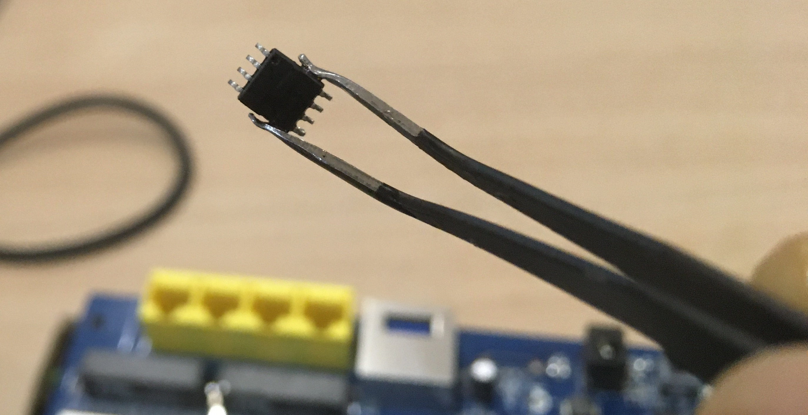
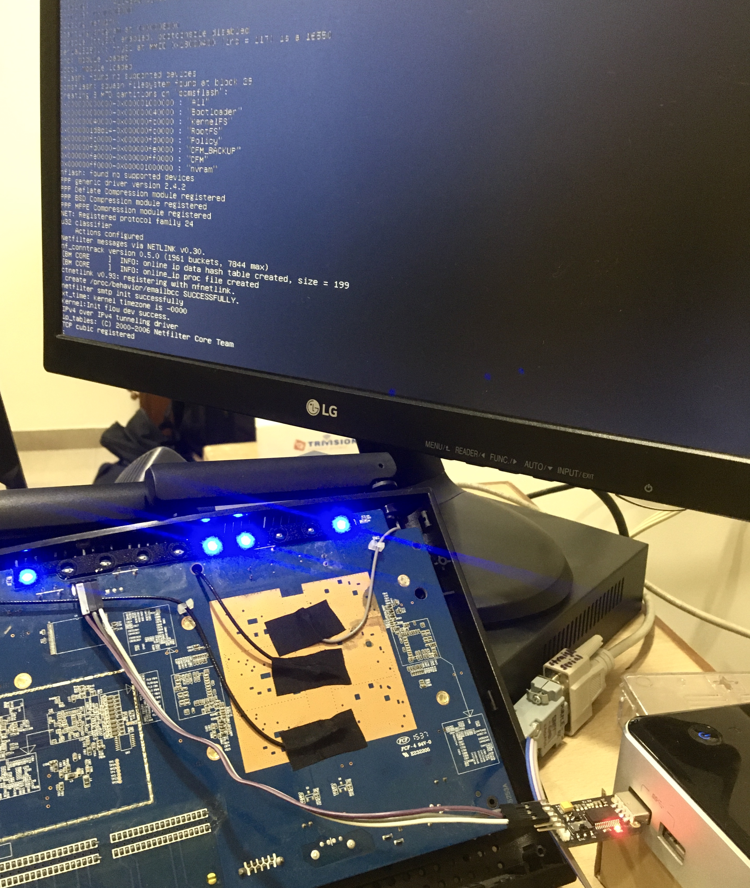
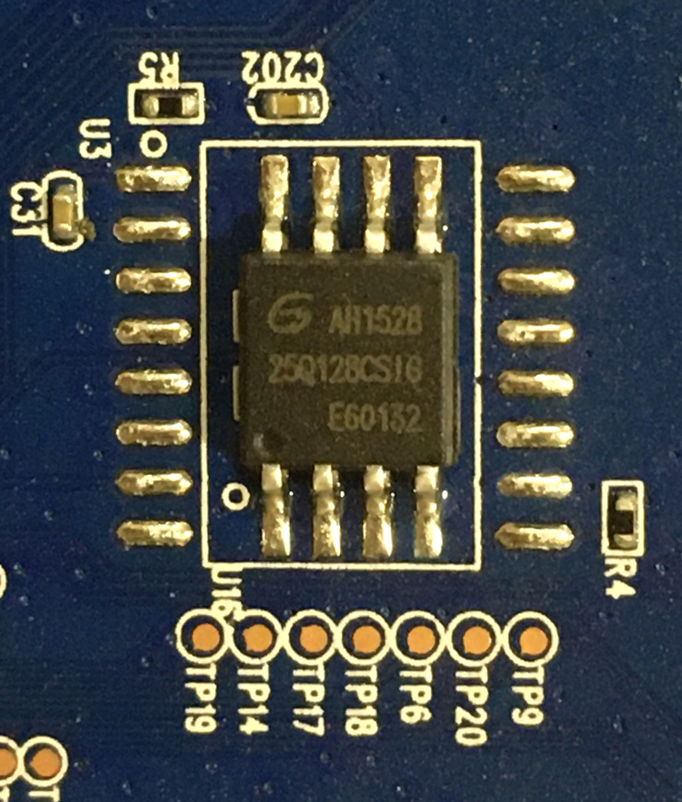
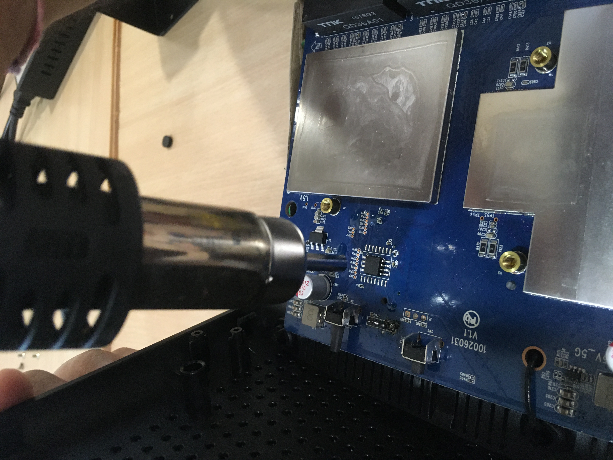
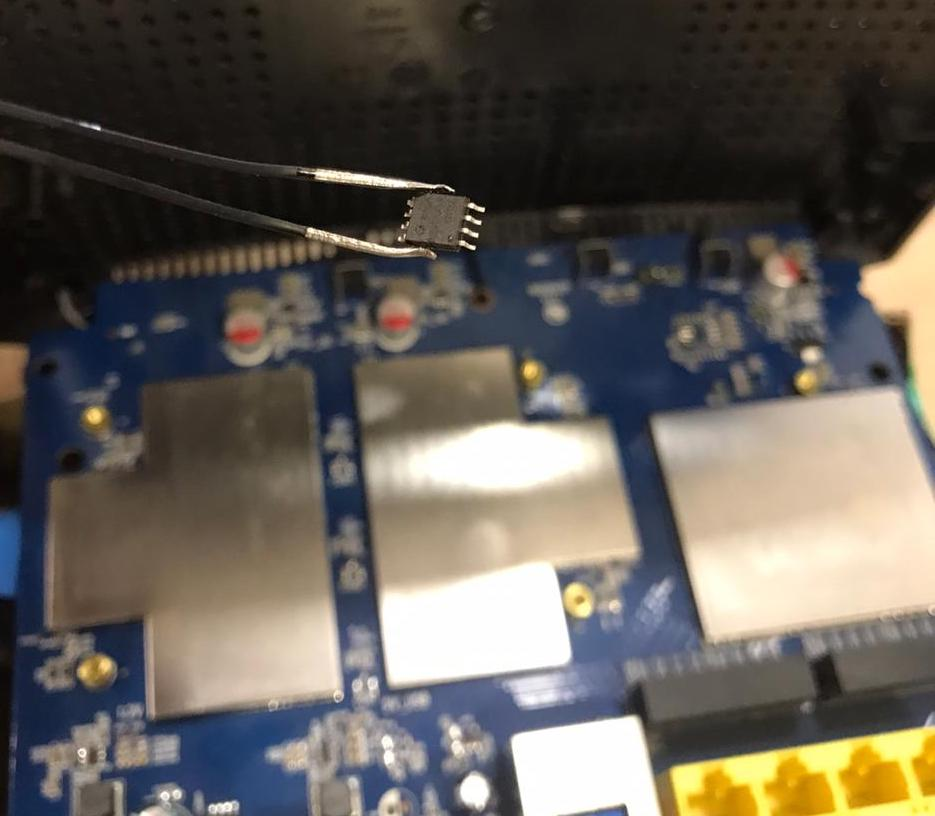
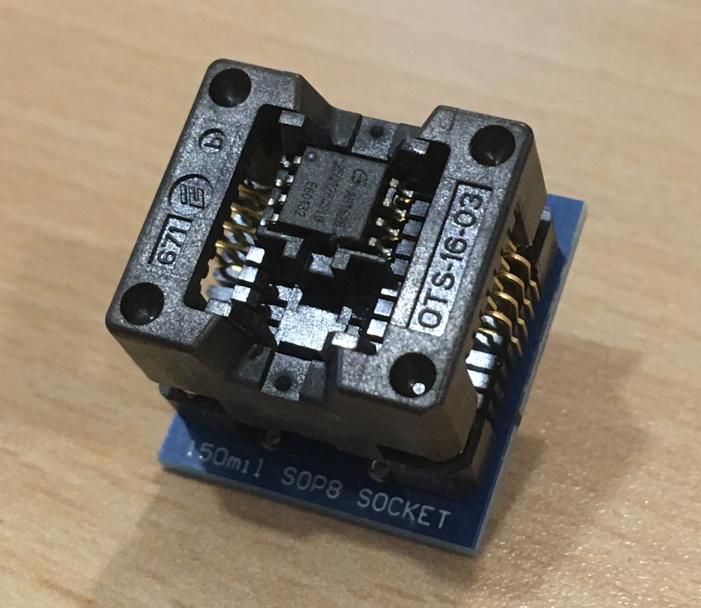
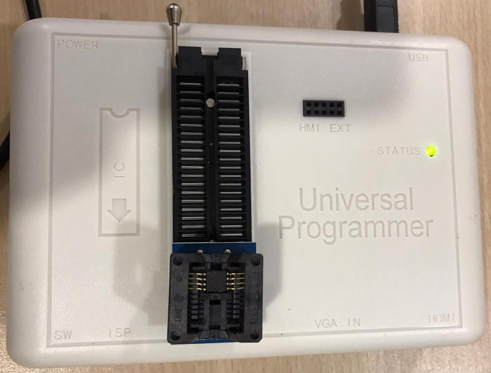
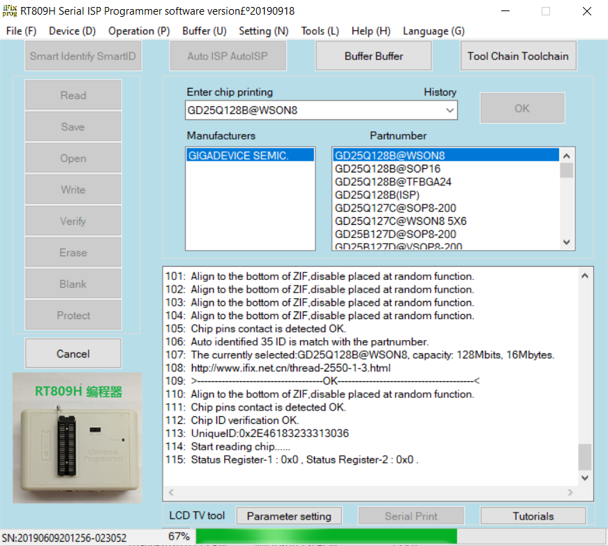
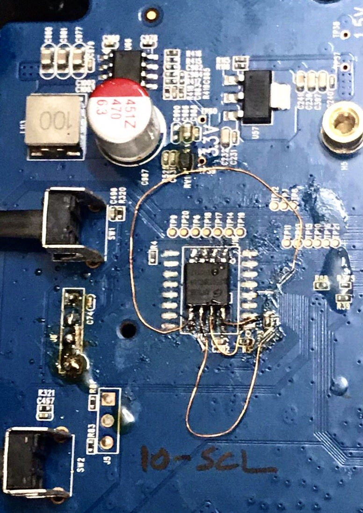

# Extracting the Tenda AC15 Firmware

by Saumil Shah [@therealsaumil][saumil]\
with hardware support from Jatan Raval [@jatankraval][jatan]

June 2020

## Summary

Extracting the [Tenda AC15 Wi-Fi Router](https://www.tendacn.com/en/product/Ac15.html)'s
firmware proved to be a challenging task. The UART is set to "view-only", by
disabling the RX pin input on the board. Reading the firmware using an SOIC-8
clip and an EEPROM programmer did not work, as the device locked the SPI flash
chip after powering on.

The only solution was to unsolder the SPI flash and extract the firmware
thereafter. This firmware was then used to [emulate the AC15 in ARM-X](https://armx.exploitlab.net/docs/emulating-tenda-ac15.html).



**CAUTION** You run the risk of bricking your device, as we learned the hard way.

## Contents

- [1](#1-inside-the-ac15) - Inside the AC15
- [2](#2-connecting-the-uart) - Connecting the UART
- [3](#3-the-ac15s-spi-flash-memory) - The AC15's SPI Flash Memory
  - [3.1](#31-removing-the-spi-flash-memory) - Removing the SPI Flash Memory
  - [3.2](#32-reading-the-contents-of-the-spi-flash-memory) - Reading the contents of the SPI Flash Memory
  - [3.3](#33-extracting-the-firmware-using-binwalk) - Extracting the firmware using Binwalk
  - [3.4](#34-extracting-individual-mtd-partitions) - Extracting individual MTD partitions
  - [3.5](#35-extracting-the-rootfs) - Extracting the RootFS
  - [3.6](#36-extracting-the-nvram) - Extracting the nvram
- [4](#4-putting-the-ac15-back-together-again) - Putting the AC15 back together again
- [5](#5-credits) - Credits
- [6](#6-concluding-thoughts) - Concluding thoughts

## 1. Inside the AC15

The picture below shows the AC15's circuit board. The UART and the SPI Flash
memory are marked in red.


## 2. Connecting the UART

As a first attempt, we always want to see if we can access an interactive shell
on the device console, in this case, the UART interface. The UART pins (GND, TX
and RX) can be identified using a simple multimeter. Refer to the
[ARM IoT Firmware Emulation](https://www.slideshare.net/saumilshah/hacklu-2018-arm-iot-firmware-emulation-workshop/19)
workshop at [Hack.LU](https://hack.lu) 2018 for details:



Connecting to the serial console using `minicom` using the usual `115200 8N1`,
we obtain the following output:

```
Digital core power voltage set to 0.9375V
Decompressing...done
Digital core power voltage set to 0.9375V

SHMOO VER 1.13

PKID07DC06011801080000000000001A103F01000000

S300001E7
000014E0


RDLYW0 00000004

RDENW0 00000031

RDQSW0

    0000000000111111111122222222223333333333444444444455555555556666
    0123456789012345678901234567890123456789012345678901234567890123
 00 --------++++++++++++++++++++++++++X+++++++++++++++++++++++++----
 01 ---------+++++++++++++++++++++++++X+++++++++++++++++++++++++----
 02 ---------+++++++++++++++++++++++++++X++++++++++++++++++++++++++-
 03 -------+++++++++++++++++++++++++X+++++++++++++++++++++++++------
 04 --++++++++++++++++++++++++++X++++++++++++++++++++++++++---------
 05 --------++++++++++++++++++++++++X++++++++++++++++++++++++-------
 06 -----+++++++++++++++++++++++++X+++++++++++++++++++++++++--------
 07 ---------+++++++++++++++++++++++++X+++++++++++++++++++++++++----
 08 --------+++++++++++++++++++++++++X+++++++++++++++++++++++++-----
 09 -----------++++++++++++++++++++++++++X++++++++++++++++++++++++--
 10 ------++++++++++++++++++++++++++X++++++++++++++++++++++++++-----
 11 ----------+++++++++++++++++++++++++X+++++++++++++++++++++++++---
 12 ------+++++++++++++++++++++++++X+++++++++++++++++++++++++-------
 13 -------------++++++++++++++++++++++++X+++++++++++++++++++++++---
 14 ------++++++++++++++++++++++++++X+++++++++++++++++++++++++------
 15 ----------+++++++++++++++++++++++++++X++++++++++++++++++++++++--

:
:
:

Starting program at 0x00008000
console [ttyS0] enabled, bootconsole disabled
serial8250.0: ttyS1 at MMIO 0x18000400 (irq = 117) is a 16550
brd: module loaded
loop: module loaded
pflash: found no supported devices
bcmsflash: squash filesystem found at block 29
Creating 8 MTD partitions on "bcmsflash":
0x000000000000-0x000001000000 : "All"
0x000000000000-0x000000040000 : "Bootloader"
0x000000040000-0x000000fc0000 : "KernelFS"
0x0000001d8d14-0x000000fc0000 : "RootFS"
0x000000fc0000-0x000000fd0000 : "Policy"
0x000000fd0000-0x000000fe0000 : "CFM_BACKUP"
0x000000fe0000-0x000000ff0000 : "CFM"
0x000000ff0000-0x000001000000 : "nvram"

:
:
:

Freeing init memory: 216K
mkdir: can't create directory '/var/run': File exists
_fastnat_attach: fastnat attach is successful  register.
fastnat_init: FastNat_init successful .
[BM CORE     ]  INFO: bm_init success
bm_debug_init_proc success!
[U2K MODULE  ]  INFO: bm_u2k_info_init success
insmod: can't read '/lib/modules/ai.ko': No such file or directory
[MAC FILTER  ]  INFO: bm_mac_filter init success
[QOS         ]  INFO: qos module init success
OS TYPE INIT FINISHED
[URL FILTER  ]  INFO: url filter init success
Give root password for system maintenance
(or type Control-D for normal startup):init_core_dump 1784: rlim_cur = 0, rlim_max = -1
init_core_dump 1793: open core dump success
init_core_dump 1802: rlim_cur = -1, rlim_max = -1
func:InitCfm begin load_mib....
flash_read:ret = 65536
crc = 3e1cef29, newcrc = 3e1cef29

######## STARTING PROGRAM #########
flash_read:ret = 65536
crc = 4e2b34d6, newcrc = 4e2b34d6
flash_read:ret = 65536
crc = 4e2b34d6, newcrc = 4e2b34d6
MTD[Policy] size is 64K
read flash:uncompress len=240468; crc=0a2959c2
left wan[0]:0
right lan[3]:1
right lan[2]:2
right lan[1]:3
right lan[0]:4

:
:
:

[TIMER_CHECK >>TimeCheckMsgHandle(163)]:msg:4?relate_module_id=19,string_info=first_time_start
[TIMER_CHECK >>init_time_check_module_var(146)]:key = relate_module_id,value = 19
tpi_sntp_handle(44): start sntp...
tpi_set_user_policy,35: entry count:0
[TIMER_CHECK >>init_time_check_module_var(154)]:key = string_info,value = first_time_start
systime_server = 211.138.200.208
main,334,sntp_en =1,tz=20.00,checktime=86400
[ DEBUG[MAC FILTER  ]  INFO: g_mac_filter_enable = disable, mf_default_action = accept
 ] RL FILTER  ]  INFO: g_uf_enable = disable
[mlan dhcp[MAC FILTER  ]  INFO: g_mac_filter_enable = disable, mf_default_action = accept
 not [URL FILTER  ]  INFO: g_uf_enable = disable
enable
Open /tmp/UDiskname is FailDisk:the file was locked.
Writesamba.config.bak OK!
Disk:/tmp/samba/lib/samba.config.bak the file was unlocked.
******* unlink /tmp/smbpasswd is fail
startsmbfilepwent_internal: file /tmp/samba/private/smbpasswd did not exist. File successfully created.
account_policy_get: tdb_fetch_uint32 failed for field 1 (min password length), returning 0
account_policy_get: tdb_fetch_uint32 failed for field 2 (password history), returning 0
account_policy_get: tdb_fetch_uint32 failed for field 3 (user must logon to change password), returning 0
account_policy_get: tdb_fetch_uint32 failed for field 4 (maximum password age), returning 0
account_policy_get: tdb_fetch_uint32 failed for field 5 (minimum password age), returning 0
account_policy_get: tdb_fetch_uint32 failed for field 6 (lockout duration), returning 0
account_policy_get: tdb_fetch_uint32 failed for field 7 (reset count minutes), returning 0
account_policy_get: tdb_fetch_uint32 failed for field 8 (bad lockout attempt), returning 0
account_policy_get: tdb_fetch_uint32 failed for field 9 (disconnect time), returning 0
account_policy_get: tdb_fetch_uint32 failed for field 10 (refuse machine password change), returning 0
Added user admin.
```

The complete output is available [here](tenda_minicom.txt).

It is not possible to interact with the Tenda console because the RX input is
disabled on the circuit board. One possibility is to trace the RX and see if
there are any resistors that we need to bypass, or perhaps directly connect to
the UART pin on the CPU.

Instead we attempted to extract the contents directly from the flash chip.

## 3. The AC15's SPI Flash Memory

The AC15 uses a Gigadevice [GD25Q128CSIG](https://www.gigadevice.com/datasheet/gd25q128c/)
128M-bit (16MB) flash memory chip:



### 3.1 Removing the SPI Flash Memory

**WARNING** this procedure may damage your router.

Use a hot air gun to heat the legs of the SPI Flash Memory from the circuit
board.



After a bit of wiggling, the chip will pry free.



### 3.2 Reading the contents of the SPI Flash Memory

Mount the chip in a 150mil SOP-8 socket:



Insert the SOP-8 socket into a Flash Programmer:



The rest is taken care of by the programmer's software:



At the end of this process, you should have a 16MB bin file containing the
entire contents of the SPI Flash Memory.

We can now proceed with

* A quick and dirty etraction using `binwalk`, and
* A more precise process of extraction using `dd`

### 3.3 Extracting the firmware using Binwalk

```
# binwalk -e Tenda_GD25Q128B_WSON8_20200611_145923.BIN

DECIMAL       HEXADECIMAL     DESCRIPTION
--------------------------------------------------------------------------------
147460        0x24004         LZMA compressed data, properties: 0x5D, dictionary
                              size: 65536 bytes, uncompressed size: 396388 bytes

262144        0x40000         TRX firmware header, little endian,
                              image size: 10559488 bytes, CRC32: 0xFA817870,
                              flags: 0x0, version: 1, header size: 28 bytes,
                              loader offset: 0x1C,
                              linux kernel offset: 0x1C9CD4, rootfs offset: 0x0

262172        0x4001C         LZMA compressed data, properties: 0x5D, dictionary
                              size: 65536 bytes, uncompressed size: 4585280
                              bytes

2137300       0x209CD4        Squashfs filesystem, little endian, version 4.0,
                              compression:xz, size: 8680744 bytes, 926 inodes,
                              blocksize: 131072 bytes, created: 2017-05-10 14:10:50

16515104      0xFC0020        Zlib compressed data, default compression
```

`binwalk` was able to extract the `rootfs` (stored as SquashFS) and the boot
loader. However we can perform a more precise MTD extraction using the
information gathered from the UART console output.

### 3.4 Extracting individual MTD partitions

Inspecting the boot messages, we come across the following information:

```
Starting program at 0x00008000
console [ttyS0] enabled, bootconsole disabled
serial8250.0: ttyS1 at MMIO 0x18000400 (irq = 117) is a 16550
brd: module loaded
loop: module loaded
pflash: found no supported devices
bcmsflash: squash filesystem found at block 29
Creating 8 MTD partitions on "bcmsflash":
0x000000000000-0x000001000000 : "All"
0x000000000000-0x000000040000 : "Bootloader"
0x000000040000-0x000000fc0000 : "KernelFS"
0x0000001d8d14-0x000000fc0000 : "RootFS"
0x000000fc0000-0x000000fd0000 : "Policy"
0x000000fd0000-0x000000fe0000 : "CFM_BACKUP"
0x000000fe0000-0x000000ff0000 : "CFM"
0x000000ff0000-0x000001000000 : "nvram"
```
Going by the MTD partition offsets above, we arrive at the following table:

| MTD Partition | Size     | Start     |  End      | Start (4k) | End (4k)  | Blocks |
|---------------|---------:|----------:|----------:|-----------:|----------:|-------:|
| Bootloader    | 256K     | 0         | 0x40000   | 0          | 64        | 64     |
| KernelFS      | 15.5M    | 0x40000   | 0xfc0000  | 64         | 4032      | 3968   |
| Policy        | 64K      | 0xfc0000  | 0xfd0000  | 4032       | 4048      | 16     |
| CFM_BACKUP    | 64K      | 0xfd0000  | 0xfe0000  | 4048       | 4064      | 16     |
| CFM           | 64K      | 0xfe0000  | 0xff0000  | 4064       | 4080      | 16     |
| nvram         | 64K      | 0xff0000  | 0x1000000 | 4080       | 4096      | 16     |

We can use the `dd` command to extract the individual MTD partitions as follows:

```
dd if=memorydump.bin of=bootloader bs=4096 skip=0 count=64
dd if=memorydump.bin of=kernelfs bs=4096 skip=64 count=3968
dd if=memorydump.bin of=policy bs=4096 skip=4032 count=16
dd if=memorydump.bin of=cfm_backup bs=4096 skip=4048 count=16
dd if=memorydump.bin of=cfm bs=4096 skip=4064 count=16
dd if=memorydump.bin of=nvram bs=4096 skip=4080 count=16
```

For extraction, it is recommended to align the partitions at block boundaries
(4096 bytes or 0x1000).

### 3.5 Extracting the RootFS

You wii notice we did not extract the RootFS partition using `dd`, as it was not
aligned to a block boundary. We will use `binwalk` to extract the RootFS from
the `kernelfs` partition.

```
# binwalk -e kernelfs

DECIMAL       HEXADECIMAL     DESCRIPTION
--------------------------------------------------------------------------------
0             0x0             TRX firmware header, little endian,
                              image size: 10559488 bytes, CRC32: 0xFA817870,
                              flags: 0x0, version: 1, header size: 28 bytes,
                              loader offset: 0x1C,
                              linux kernel offset: 0x1C9CD4, rootfs offset: 0x0

28            0x1C            LZMA compressed data, properties: 0x5D,
                              dictionary size: 65536 bytes,
                              uncompressed size: 4585280 bytes

1875156       0x1C9CD4        Squashfs filesystem, little endian, version 4.0,
                              compression:xz, size: 8680744 bytes, 926 inodes,
                              blocksize: 131072 bytes,
                              created: 2017-05-10 14:10:50
```
Looking inside `_kernelfs.extracted/` we find an extracted RootFS under
`squashfs-root`

```
# ls -la squashfs-root/
total 60
drwxr-xr-x   15 root     root          4096 May 10  2017 .
drwxr-sr-x    3 root     krafty        4096 Jun 22 18:58 ..
drwxr-xr-x    2 root     root          4096 May 10  2017 bin
drwxr-xr-x    2 root     root          4096 May 10  2017 cfg
drwxr-xr-x    2 root     root          4096 May 10  2017 dev
lrwxrwxrwx    1 root     root             8 Jun 22 18:58 etc -> /var/etc
drwxr-xr-x    8 root     root          4096 May 10  2017 etc_ro
lrwxrwxrwx    1 root     root             9 Jun 22 18:58 home -> /var/home
lrwxrwxrwx    1 root     root            11 Jun 22 18:58 init -> bin/busybox
drwxr-xr-x    3 root     root          4096 May 10  2017 lib
drwxr-xr-x    2 root     root          4096 May 10  2017 mnt
drwxr-xr-x    2 root     root          4096 May 10  2017 proc
lrwxrwxrwx    1 root     root             9 Jun 22 18:58 root -> /var/root
drwxr-xr-x    2 root     root          4096 May 10  2017 sbin
drwxr-xr-x    2 root     root          4096 May 10  2017 sys
drwxr-xr-x    2 root     root          4096 May 10  2017 tmp
drwxr-xr-x    6 root     root          4096 May 10  2017 usr
drwxr-xr-x    6 root     root          4096 May 10  2017 var
lrwxrwxrwx    1 root     root            11 Jun 22 18:58 webroot -> var/webroot
drwxr-xr-x    8 root     root          4096 May 10  2017 webroot_ro
```

### 3.6 Extracting the nvram

It is easy to inspect the contents of `nvram` using `hexdump` or `strings`. It
is also recommended to inspect `cfm` as it is used by the `cfmd` process when
the AC15 starts up.

```
# strings nvram

FLSH s
wl1.11_wme_txp_bk=7 3 6 2 0
wl0.9_wme_apsd=off
wl1_wme=on
wl0_pspretend_threshold=0
wl0.2_ap_isolate=0
wl1_auth=0
wl1.5_wme_no_ack=off
wl0_wmf_bss_enable=1
wl0_rxchain_pwrsave_stas_assoc_check=0
wl0.7_wme_txp_be=7 3 4 2 0
wl0.1_wme_sta_vo=3 7 2 3264 1504 off off
wl1_hwaddr=C8:3A:35:32:CE:B5
wl1.10_wme_txp_vi=7 3 6 2 0
wl0_rifs_advert=auto
wl0_mcast_regen_bss_enable=1
:
:
```

```
hexdump -C cfm

00000000  30 24 18 f4 a2 00 00 00  61 64 76 2e 69 70 74 76  |0$......adv.iptv|
00000010  2e 73 74 62 61 6c 6c 76  6c 61 6e 73 3d 0a 77 6c  |.stballvlans=.wl|
00000020  35 67 2e 73 73 69 64 30  2e 77 70 61 70 73 6b 5f  |5g.ssid0.wpapsk_|
00000030  70 73 6b 3d 65 78 70 6c  6f 69 74 6c 61 62 0a 77  |psk=exploitlab.w|
00000040  6c 32 67 2e 73 73 69 64  30 2e 77 70 61 5f 63 72  |l2g.ssid0.wpa_cr|
00000050  79 70 74 6f 3d 61 65 73  0a 77 6c 32 67 2e 73 73  |ypto=aes.wl2g.ss|
00000060  69 64 31 2e 77 70 61 5f  63 72 79 70 74 6f 3d 61  |id1.wpa_crypto=a|
00000070  65 73 0a 61 64 76 2e 6e  61 74 6c 69 6d 69 74 2e  |es.adv.natlimit.|
00000080  6c 69 73 74 6e 75 6d 3d  30 0a 61 64 76 2e 69 70  |listnum=0.adv.ip|
00000090  74 76 2e 73 74 62 6f 6c  64 76 6c 61 6e 73 3d 0a  |tv.stboldvlans=.|
000000a0  73 79 73 2e 73 63 68 65  64 2e 77 69 66 69 2e 65  |sys.sched.wifi.e|
000000b0  6e 61 62 6c 65 3d 30 0a  77 6c 35 67 2e 73 73 69  |nable=0.wl5g.ssi|
000000c0  64 30 2e 77 70 61 5f 63  72 79 70 74 6f 3d 61 65  |d0.wpa_crypto=ae|
000000d0  73 0a 77 6c 35 67 2e 73  73 69 64 31 2e 77 70 61  |s.wl5g.ssid1.wpa|
000000e0  5f 63 72 79 70 74 6f 3d  61 65 73 0a 6c 61 6e 5f  |_crypto=aes.lan_|
000000f0  69 66 6e 61 6d 65 3d 62  72 30 0a 77 6c 32 67 2e  |ifname=br0.wl2g.|
00000100  70 75 62 6c 69 63 2e 62  61 6e 64 77 69 64 74 68  |public.bandwidth|
00000110  3d 61 75 74 6f 0a 75 73  62 2e 73 61 6d 62 61 2e  |=auto.usb.samba.|
00000120  67 75 65 73 74 2e 61 63  65 73 73 3d 72 0a 77 61  |guest.acess=r.wa|
00000130  6e 73 2e 6c 6f 61 64 62  61 6c 61 6e 63 65 74 79  |ns.loadbalancety|
00000140  70 65 3d 30 0a 77 6c 35  67 2e 70 75 62 6c 69 63  |pe=0.wl5g.public|
00000150  2e 62 61 6e 64 77 69 64  74 68 3d 38 30 0a 77 6c  |.bandwidth=80.wl|
00000160  32 67 2e 65 6e 61 62 6c  65 3d 30 0a 70 6f 72 74  |2g.enable=0.port|
```

## 4. Putting the AC15 back together again

After the firmware extraction, you will need to solder the SPI Flash Memory
back in its original location on the circuit board. We ended up damaging our
circuit board in the process and for now, we have a bricked Tenda AC15 on our
hands!

**UPDATE** We managed to unbrick the Tenda AC15. We had a friend solder the
SPI Flash Memory on the board and rig wires to the correct points on the PCB.



## 5. Credits

I would like to thank my colleague [Jatan Raval][jatan] for working with me on
this project.

I would also like to give props to [Kai-Jern "XWings" Lau][xwings] for his
tips on firmware extraction and for making the incredibly awesome
[Qiling Framework][qiling]!

## 6. Concluding thoughts

This article was intended to familiarise you with what it takes to extract
firmware directly from an SPI Flash Memory chip.

This article is an addition to ["Emulating the Tenda AC15 Wi-Fi Router with ARM-X"](emulating-tenda-ac15.html)

A fully emulated Tenda AC15 is available in the [ARM-X Preview VM][PreviewVM].
I encourage all readers to download it and try it out.

Follow me on Twitter *[@therealsaumil][saumil]* for updates on [ARM-X][armx],
new articles, talks and [trainings][R0ARM]!

### BX LR

[R0ARM]: https://ringzer0.training/arm-iot-firmwarelab.html
[armx]: https://armx.exploitlab.net/
[PreviewVM]: https://armx.exploitlab.net/#downloads
[saumil]: https://twitter.com/therealsaumil
[jatan]: https://twitter.com/jatankraval
[xwings]: https://twitter.com/sgniwx
[qiling]: https://qiling.io
