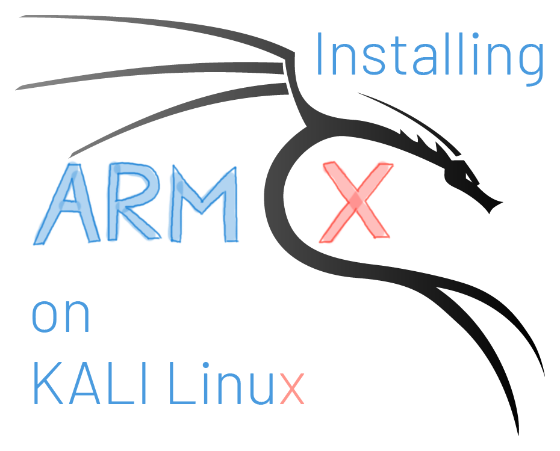

## ARM-X installation instructions - tested on Kali Linux 

Contributed by [@zh4ck][zh4ck]

[zh4ck]: https://twitter.com/zh4ck



> **TL;DR:**
>
> **A quick installation guide to setting up [ARM-X][ARM-X] on Kali Linux. Thanks to [Z. Balasz][zh4ck] for his efforts in testing and writing these notes.**

[ARM-X]: https://armx.exploitlab.net

### 1. Set up some pre-requisites

``` 
sudo apt install -y qemu dialog bridge-utils uml-utilities nfs-kernel-server gdb-multiarch

sudo sh -c 'echo "\n\n/armx   192.168.100.0/24(rw,sync,no_root_squash,no_subtree_check)\n" >> /etc/exports'
sudo systemctl enable nfs-kernel-server
```

### 2. Clone ARM-X

```
git clone https://github.com/therealsaumil/armx
cd armx/hostfs
unzip hostfs.ext2.zip
cd ..
```

### 3. Create bridge interface

```
sudo sh -c 'echo "auto br0\niface br0 inet dhcp\npre-up brctl addbr br0\npost-down brctl delbr br0" > /etc/network/interfaces.d/br0'
sudo etc/local.d/10-tun-network.start
sudo networking restart
```

### 4. TODO check /etc/local.d exists and executes on Kali

```
sudo sh -c 'cat etc/local.d/10-tun-network.start >> /etc/rc.local'
sudo cp usr/local/bin/restart-taps /usr/local/bin/restart-taps
cp home/kali/.ssh/id_rsa.armx* /home/kali/.ssh/

wget -O ~/.gdbinit-gef.py -q http://gef.blah.cat/py
echo source ~/.gdbinit-gef.py >> ~/.gdbinit

cd ..
sudo mv armx/ /
sudo chown -R kali /armx
export PATH=$PATH:/armx/run	# It is best to add your shell profile this path
``` 

### 5. Create your first test device

You can extract the following files from Damn Vulnerable Arm Router: https://app.box.com/s/g2k7vo45ctn5lh0enrwg6i83abwindte

``` 
mkdir -p /armx/DVAR/kernel 
cp zImage-3.16.57-vexpress /armx/DVAR/kernel/
cp config /armx/DVAR/
cp rootfs /armx/DVAR/
``` 

### 6. Start the ARM-X framework

Run:

```
launcher  
```
Choose Damn Vulnerable Arm Router. Once it boots:
``` 
ssh -i /home/kali/.ssh/id_rsa.armx root@192.168.100.2 
Choose option 1 - this will start the init scripts
``` 

### 7. Make armxgdb Kali compatible

By default, `armxgdb` uses `arm-linux-gnueabi-gdb`. On Kali, it is `gdb-multiarch` and add the following line to the end of `armxgdb`:

```
-ex="set architecture arm"
```

- [Home][Home]
- [Github][Github]

[Home]: https://armx.exploitlab.net/
[Github]: https://github.com/therealsaumil/armx
